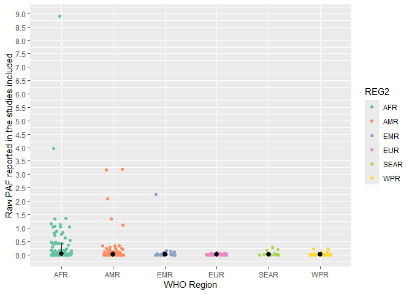
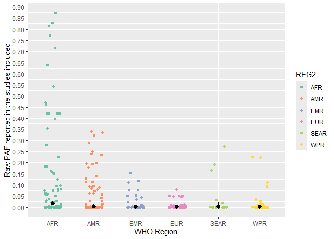

Aflatoxin B1 model - attributable fraction of aflatoxin B1
================
LoVa3397
2025-10-03

- [Settings](#settings)
- [Data cleaning](#data-cleaning)
- [Conversion maize](#conversion-maize)
- [Conversion peanuts](#conversion-peanuts)
- [ISO3 and exposure maize](#iso3-and-exposure-maize)
- [ISO3 and exposure peanuts](#iso3-and-exposure-peanuts)
- [Combined exposure](#combined-exposure)
- [BW](#bw)
- [Hepatitis B dataset](#hepatitis-b-dataset)
- [PAF calculation](#paf-calculation)

``` r
# AFB1 model - population attributalble fraction of aflatoxin-induced hepatocellular carcinoma
# Based on model in FERG1 

```

# Settings

``` r
rm(list=ls())

# packages
library(tidyverse)
library(mc2d)
library(dplyr)
# library(xlsx)
library(readxl)
library(devtools)
#install_github("brechtdv/FERG2")
library(FERG2)
library(openxlsx)

# settings
set.seed(123)

nvar <- 1e5
nunc <- 1e3

mean_median_ci <-
  function(x) {
    c(mean = mean(x),
      median = median(x),
      quantile(x, probs = c(0.025, 0.975)))
  }

# Load datasets

#maize concentration and consumption
conc_maize <- read.xlsx("aflatoxin_exposure_OCT2025.xlsx",sheet = "maize concentration new") 
cons_maize <- read.xlsx("aflatoxin_exposure_OCT2025.xlsx",sheet = "maize consumption") 

#peanut concentration and consumption
conc_peanuts <- read.xlsx("aflatoxin_exposure_OCT2025.xlsx",sheet = "peanuts concentration new") 
cons_peanuts <- read.xlsx("aflatoxin_exposure_OCT2025.xlsx",sheet = "peanuts consumption") 

```

# Data cleaning

``` r
#remove NA

conc_maize <- subset(conc_maize, !is.na(SOURCE_YEAR)) # only NA lines removed
cons_maize <- subset(cons_maize, !is.na(VALUE_MEAN)) # only NA lines removed

conc_peanuts <- subset(conc_peanuts, !is.na(SOURCE_YEAR)) # only NA lines removed

# Additional data cleaning
conc_maize$FLAG <- 0
conc_peanuts$FLAG <- 0
cons_maize$FLAG <- 0
cons_peanuts$FLAG <- 0

Territories <- read_xlsx("Territories_R_20250221.xlsx")
Flag_territory <- unlist(Territories)

conc_maize$FLAG_REF_LOCATION <- as.integer(apply(sapply(Flag_territory, function(x) grepl(x, conc_maize$REF_LOCATION, ignore.case = TRUE)), 1, any))
conc_maize$FLAG_REF_NOTES <- as.integer(apply(sapply(Flag_territory, function(x) grepl(x, conc_maize$REF_NOTES, ignore.case = TRUE)), 1, any))
conc_maize$FLAG_SOURCE_TITLE <- as.integer(apply(sapply(Flag_territory, function(x) grepl(x, conc_maize$SOURCE_TITLE, ignore.case = TRUE)), 1, any))
conc_maize$FLAG_TERRITORY <- if_else(conc_maize$FLAG_REF_LOCATION + conc_maize$FLAG_REF_NOTES + conc_maize$FLAG_SOURCE_TITLE >=1 , 1, 0)

conc_maize$FLAG <- if_else(conc_maize$FLAG_TERRITORY == 1 & conc_maize$FLAG == 0, 
                    1, 
                    conc_maize$FLAG)

conc_peanuts$FLAG_REF_LOCATION <- as.integer(apply(sapply(Flag_territory, function(x) grepl(x, conc_peanuts$REF_LOCATION, ignore.case = TRUE)), 1, any))
conc_peanuts$FLAG_REF_NOTES <- as.integer(apply(sapply(Flag_territory, function(x) grepl(x, conc_peanuts$REF_NOTES, ignore.case = TRUE)), 1, any))
conc_peanuts$FLAG_SOURCE_TITLE <- as.integer(apply(sapply(Flag_territory, function(x) grepl(x, conc_peanuts$SOURCE_TITLE, ignore.case = TRUE)), 1, any))
conc_peanuts$FLAG_TERRITORY <- if_else(conc_peanuts$FLAG_REF_LOCATION + conc_peanuts$FLAG_REF_NOTES + conc_peanuts$FLAG_SOURCE_TITLE >=1 , 1, 0)

conc_peanuts$FLAG <- if_else(conc_peanuts$FLAG_TERRITORY == 1 & conc_peanuts$FLAG == 0, 
                           1, 
                           conc_peanuts$FLAG)

cons_maize$FLAG_REF_LOCATION <- as.integer(apply(sapply(Flag_territory, function(x) grepl(x, cons_maize$REF_LOCATION, ignore.case = TRUE)), 1, any))
cons_maize$FLAG_REF_NOTES <- as.integer(apply(sapply(Flag_territory, function(x) grepl(x, cons_maize$REF_NOTES, ignore.case = TRUE)), 1, any))
cons_maize$FLAG_SOURCE_TITLE <- as.integer(apply(sapply(Flag_territory, function(x) grepl(x, cons_maize$SOURCE_TITLE, ignore.case = TRUE)), 1, any))
cons_maize$FLAG_TERRITORY <- if_else(cons_maize$FLAG_REF_LOCATION + cons_maize$FLAG_REF_NOTES + cons_maize$FLAG_SOURCE_TITLE >=1 , 1, 0)

cons_maize$FLAG <- if_else(cons_maize$FLAG_TERRITORY == 1 & cons_maize$FLAG == 0, 
                           1, 
                           cons_maize$FLAG)

cons_peanuts$FLAG_REF_LOCATION <- as.integer(apply(sapply(Flag_territory, function(x) grepl(x, cons_peanuts$REF_LOCATION, ignore.case = TRUE)), 1, any))
cons_peanuts$FLAG_REF_NOTES <- as.integer(apply(sapply(Flag_territory, function(x) grepl(x, cons_peanuts$REF_NOTES, ignore.case = TRUE)), 1, any))
cons_peanuts$FLAG_SOURCE_TITLE <- as.integer(apply(sapply(Flag_territory, function(x) grepl(x, cons_peanuts$SOURCE_TITLE, ignore.case = TRUE)), 1, any))
cons_peanuts$FLAG_TERRITORY <- if_else(cons_peanuts$FLAG_REF_LOCATION + cons_peanuts$FLAG_REF_NOTES + cons_peanuts$FLAG_SOURCE_TITLE >=1 , 1, 0)

cons_peanuts$FLAG <- if_else(cons_peanuts$FLAG_TERRITORY == 1 & cons_peanuts$FLAG == 0, 
                             1, 
                             cons_peanuts$FLAG)

```

# Conversion maize

``` r
#Convert all units to micrograms per gram
# Create a conversion lookup table
conversion_factors <- list(
  "ng/g" = 1,
  "ng/g (mg/kg)" = 1,
  "ng/g (ug/kg(" = 1,
  "ng/g (ug/kg)" = 1,
  "ppb" =1 ,
  "ppb (ug/kg)" = 1,
  "ug/kg" = 1,
  "ug/kg " = 1,
  "ug/kg (ng/g)" = 1,
  "ug/kg (ng/g)" =1
  )

units_to_exclude <- "0"


# Apply the function to each row
conc_maize$converted_value <- 0

for(i in 1:nrow(conc_maize)) {
  value = as.numeric(conc_maize$VALUE_MEAN[i])
  unit = conc_maize$VALUE_UNIT[i]
  
  if (unit %in% names(conversion_factors)) {
    conc_maize$converted_value[i] <- value * as.numeric(conversion_factors[[unit]])
  } else {
    conc_maize$converted_value[i] <- value
  }
  
}

```

# Conversion peanuts

``` r
#Convert all units to micrograms per gram
# Create a conversion lookup table
conversion_factors <- list(
  "ng/g" = 1,
  "ng/g (mg/kg)" = 1,
  "ng/g (ug/kg(" = 1,
  "ng/g (ug/kg)" = 1,
  "ppb" =1 ,
  "ppb (ug/kg)" = 1,
  "ug/kg" = 1,
  "ug/kg " = 1,
  "ug/kg (ng/g)" = 1,
  "ug/kg (ng/g)" =1
)

units_to_exclude <- "0"


# Apply the function to each row
conc_peanuts$converted_value <- 0

for(i in 1:nrow(conc_peanuts)) {
  value = as.numeric(conc_peanuts$VALUE_MEAN[i])
  unit = conc_peanuts$VALUE_UNIT[i]
  
  if (unit %in% names(conversion_factors)) {
    conc_peanuts$converted_value[i] <- value * as.numeric(conversion_factors[[unit]])
  } else {
    conc_peanuts$converted_value[i] <- value
  }
  
}

```

# ISO3 and exposure maize

``` r
# Correct ISO location 

conc_maize$COUNTRY <-
  FERG2:::countries$COUNTRY[match(conc_maize$REF_LOCATION_ISO3, FERG2:::countries$ISO3)]
conc_maize$ISO3 <-
  FERG2:::countries$ISO3[match(conc_maize$REF_LOCATION_ISO3, FERG2:::countries$ISO3)]

cons_maize <- cons_maize %>% 
  mutate(REF_LOCATION_ISO3 = case_when(
    # REF_LOCATION == "China, mainland" ~ "CHN", # Not necessary, China has already data point
    REF_LOCATION == "Eswatini" ~ "SWZ",
    REF_LOCATION == "Libya" ~ "LBY",
    REF_LOCATION == "North Macedonia" ~ "MKD",
    .default = REF_LOCATION_ISO3
  ))
cons_maize$COUNTRY <-
  FERG2:::countries$COUNTRY[match(cons_maize$REF_LOCATION_ISO3, FERG2:::countries$ISO3)]
cons_maize$ISO3 <-
  FERG2:::countries$ISO3[match(cons_maize$REF_LOCATION_ISO3, FERG2:::countries$ISO3)]

conc_maize$ROW_ID <- c(1:nrow(conc_maize))
cons_maize_flag <- cons_maize
cons_maize_flag$FLAG<-factor(cons_maize_flag$FLAG,
                            levels=c(0,1,2,3,4,5,6, 7),
                            labels=c("Keep data", "Data part of non WHO member states", "No WHO REG2 given",
                                     "Year before 1990", "yi can't be calcualted", "TF choice to remove",
                                     "Excluded by preliminary checks", "Excluded in data cleaning"))

# Exposure
Exposure <- c()
Exposure_df <- c()

for( j in unique(cons_maize$COUNTRY)){
  
  country <- j
  
  if(is.na(country)) {
    print("Country is NA")
  } else { 
  
  iso3 <- cons_maize[cons_maize$COUNTRY %in% country,]
  
  concentration <- conc_maize[conc_maize$COUNTRY %in% country,]
  consumption <- cons_maize[as.character(cons_maize$COUNTRY) %in% country,]
  
  if(nrow(concentration) > 0) {
    
    for( k in 1:nrow(concentration)) {
      Exposu <- consumption$VALUE_MEAN * concentration[k,"VALUE_MEAN"] 
      Exposure <- cbind.data.frame(country,k,Exposu, concentration[k, "SOURCE_ID"], concentration[k, "ROW_ID"], 
                                   concentration[k, "SOURCE_YEAR"], concentration[k, "REF_YEAR_START"], 
                                   concentration[k, "REF_YEAR_END"], concentration[k, "REF_NOTES"],
                                   concentration[k, "ISO3"])
      colnames(Exposure) <- c("country","k","value", "SOURCE_ID", "ROW_ID", "SOURCE_YEAR", "REF_YEAR_START", "REF_YEAR_END",
                              "REF_NOTES", "REF_LOCATION_ISO3")
      Exposure_df <- rbind.data.frame(Exposure_df,Exposure)
      
      
    }
    
  } else {
  k <- 0 
  Exposure <- cbind.data.frame(country,k,0,NA,NA,iso3[1, "SOURCE_YEAR"],
                               iso3[1, "REF_YEAR_START"],iso3[1, "REF_YEAR_END"],
                               NA, iso3[1, "ISO3"])
  colnames(Exposure) <- c("country","k","value", "SOURCE_ID", "ROW_ID", "SOURCE_YEAR", "REF_YEAR_START", "REF_YEAR_END",
                          "REF_NOTES", "REF_LOCATION_ISO3")
  Exposure_df <- rbind.data.frame(Exposure_df,Exposure)
    
    }
  }
  }

Exposure_maize <- Exposure_df

```

# ISO3 and exposure peanuts

``` r
# Correct ISO location 
conc_peanuts$COUNTRY <-
  FERG2:::countries$COUNTRY[match(conc_peanuts$REF_LOCATION_ISO3, FERG2:::countries$ISO3)]
conc_peanuts$ISO3 <-
  FERG2:::countries$ISO3[match(conc_peanuts$REF_LOCATION_ISO3, FERG2:::countries$ISO3)]

cons_peanuts <- cons_peanuts %>% 
  mutate(REF_LOCATION_ISO3 = case_when(
    # REF_LOCATION == "China, mainland" ~ "CHN", # Not necessary, China has already data point 
    REF_LOCATION == "Eswatini" ~ "SWZ",
    REF_LOCATION == "Libya" ~ "LBY",
    REF_LOCATION == "North Macedonia" ~ "MKD",
    .default = REF_LOCATION_ISO3
  ))
cons_peanuts$COUNTRY <-
  FERG2:::countries$COUNTRY[match(cons_peanuts$REF_LOCATION_ISO3, FERG2:::countries$ISO3)]
cons_peanuts$ISO3 <-
  FERG2:::countries$ISO3[match(cons_peanuts$REF_LOCATION_ISO3, FERG2:::countries$ISO3)]

conc_peanuts$ROW_ID <- c(1:nrow(conc_peanuts))
cons_peanuts_flag <- cons_peanuts
cons_peanuts_flag$FLAG<-factor(cons_peanuts_flag$FLAG,
                             levels=c(0,1,2,3,4,5,6, 7),
                             labels=c("Keep data", "Data part of non WHO member states", "No WHO REG2 given",
                                      "Year before 1990", "yi can't be calcualted", "TF choice to remove",
                                      "Excluded by preliminary checks", "Excluded in data cleaning"))

# Exposure
Exposure <- c()
Exposure_df <- c()

for( j in unique(cons_peanuts$COUNTRY)){
  
  country <- j
  
  if(is.na(country)) {
    print("Country is NA")
  } else { 
    
    iso3 <- cons_peanuts[cons_peanuts$COUNTRY %in% country,]
    
    concentration <- conc_peanuts[conc_peanuts$COUNTRY %in% country,]
    consumption <- cons_peanuts[as.character(cons_peanuts$COUNTRY) %in% country,]
    
    if(nrow(concentration) > 0) {
      
      for( k in 1:nrow(concentration)) {
        Exposu <- consumption$VALUE_MEAN * concentration[k,"VALUE_MEAN"] 
        Exposure <- cbind.data.frame(country,k,Exposu, concentration[k, "SOURCE_ID"], concentration[k, "ROW_ID"], 
                                     concentration[k, "SOURCE_YEAR"], concentration[k, "REF_YEAR_START"], 
                                     concentration[k, "REF_YEAR_END"], concentration[k, "REF_NOTES"],
                                     concentration[k, "ISO3"])
        colnames(Exposure) <- c("country","k","value", "SOURCE_ID", "ROW_ID", "SOURCE_YEAR", "REF_YEAR_START", "REF_YEAR_END",
                                "REF_NOTES", "REF_LOCATION_ISO3")
        Exposure_df <- rbind.data.frame(Exposure_df,Exposure)
        
      }
      
    } else {
      k <- 0 
      Exposure <- cbind.data.frame(country,k,0,NA, NA,iso3[1, "SOURCE_YEAR"],
                                   iso3[1, "REF_YEAR_START"],iso3[1, "REF_YEAR_END"],
                                   NA, iso3[1, "ISO3"])
      colnames(Exposure) <- c("country","k","value", "SOURCE_ID", "ROW_ID", "SOURCE_YEAR", "REF_YEAR_START", "REF_YEAR_END",
                              "REF_NOTES", "REF_LOCATION_ISO3")
      Exposure_df <- rbind.data.frame(Exposure_df,Exposure)  
      
      
    }
  }
}

Exposure_peanuts <- Exposure_df
```

# Combined exposure

``` r
#Combined exposure from maize and peanut
# Make variable year
Exposure_maize$REF_YEAR_START <- if_else(is.na(Exposure_maize$REF_YEAR_START),
                                         as.numeric(Exposure_maize$SOURCE_YEAR) - 1,
                                         Exposure_maize$REF_YEAR_START)
Exposure_maize$REF_YEAR_END <- if_else(is.na(Exposure_maize$REF_YEAR_END),
                                         as.numeric(Exposure_maize$SOURCE_YEAR) - 1,
                                         Exposure_maize$REF_YEAR_END)
Exposure_maize$YEAR <- round(rowMeans(cbind(Exposure_maize$REF_YEAR_START, Exposure_maize$REF_YEAR_END)))

Exposure_peanuts$REF_YEAR_START <- if_else(is.na(Exposure_peanuts$REF_YEAR_START),
                                         as.numeric(Exposure_peanuts$SOURCE_YEAR) - 1,
                                         Exposure_peanuts$REF_YEAR_START)
Exposure_peanuts$REF_YEAR_END <- if_else(is.na(Exposure_peanuts$REF_YEAR_END),
                                       as.numeric(Exposure_peanuts$SOURCE_YEAR) - 1,
                                       Exposure_peanuts$REF_YEAR_END)
Exposure_peanuts$YEAR <- round(rowMeans(cbind(Exposure_peanuts$REF_YEAR_START, Exposure_peanuts$REF_YEAR_END)))

# Check by country how much exposure data points there are
ksum <- aggregate(Exposure_maize$k, list(Exposure_maize$country), FUN=max)
colnames(ksum)  <- c("country", "ksum")
Exposure_maize <- left_join(Exposure_maize, ksum, by= "country")

ksum <- aggregate(Exposure_peanuts$k, list(Exposure_peanuts$country), FUN=sum)
colnames(ksum)  <- c("country", "ksum")
Exposure_peanuts <- left_join(Exposure_peanuts, ksum, by= "country")

# Rename variables to make merging easier
Exposure_maize_clean <- Exposure_maize[,c("country", "REF_LOCATION_ISO3", "value", "YEAR", "SOURCE_ID", "ROW_ID")]
colnames(Exposure_maize_clean) <- c("country", "ISO3", "exposure_maize", "YEAR_maize", "SOURCE_ID_maize", "ROW_ID_MAIZE")

Exposure_peanuts_clean <- Exposure_peanuts[,c("country", "REF_LOCATION_ISO3", "value", "YEAR", "SOURCE_ID", "ROW_ID")]
colnames(Exposure_peanuts_clean) <- c("country", "ISO3", "exposure_peanuts", "YEAR_peanuts", "SOURCE_ID_peanuts", "ROW_ID_PEANUTS")

Exposure_maize_clean <- as.data.table(Exposure_maize_clean)
Exposure_peanuts_clean <- as.data.table(Exposure_peanuts_clean)
Exposure_maize_clean$ID_maize <- seq.int(nrow(Exposure_maize_clean))
Exposure_peanuts_clean$ID_peanuts <- seq.int(nrow(Exposure_peanuts_clean))

# Match all data points of maize with data points of peanuts by country
matches <- Exposure_maize_clean[Exposure_peanuts_clean, on = c("country", "ISO3"), allow.cartesian = TRUE]
# Calulcate difference between years, to take the closest
matches[, diff := abs(YEAR_maize - YEAR_peanuts)]
# Make sure that best matches are chosen for maize
best_matches_maize <- matches[, .SD[which.min(diff)], by = .(country, ISO3, YEAR_maize, ID_maize)]
# Make sure that best matches are chosen for peanuts
best_matches_peanuts <- matches[, .SD[which.min(diff)], by = .(country, ISO3, YEAR_peanuts, ID_peanuts)]
# Append both and deduplicate to make sure that we don't have doubles
all_matches <- rbind(best_matches_maize, best_matches_peanuts)
all_matches <- distinct(all_matches) 

Combined_exposure <- all_matches
Combined_exposure$YEAR <- round(rowMeans(cbind(Combined_exposure$YEAR_maize, Combined_exposure$YEAR_peanuts)))
# Combined_exposure <- merge.data.frame(x = Exposure_maize,y = Exposure_peanuts,by = c("country", "YEAR"))
Combined_exposure$total <- Combined_exposure$exposure_maize + Combined_exposure$exposure_peanuts
Combined_exposure <- Combined_exposure[,c("country", "ISO3", "YEAR", 
                                          "ROW_ID_MAIZE", "SOURCE_ID_maize", "ID_maize", "exposure_maize", "YEAR_maize",
                                          "ROW_ID_PEANUTS", "SOURCE_ID_peanuts", "ID_peanuts", "exposure_peanuts", "YEAR_peanuts",
                                          "total")]

```

# BW

``` r
# Load BW
# Read BW data set and take mean by region
BW <-  read.xlsx("BW.xlsx", sheet = 1)
BW <- BW[1:35,c(1,8)]
names(BW) <- c("REGION","BW")
BW <- subset(BW, !(is.na(BW) | BW == "NO BW" | BW == "NA"))
BW <- BW %>%
  mutate(REG2 = case_when(
    REGION == "AFRO" ~ "AFR", 
    REGION ==  "EMRO" ~ "EMR",
    REGION ==  "EURO" ~ "EUR",
    REGION == "PAHO" ~ "AMR",
    REGION == "SEARO" ~"SEAR", 
    REGION == "WIPRO" ~"WPR"))
BW$BW <- as.numeric(BW$BW)
BW <- aggregate(BW ~ REG2, BW, mean)

# Add information about geography to data points
# Combined_exposure$ISO3 <- Combined_exposure$REF_LOCATION_ISO3.x
Combined_exposure$REG2 <- FERG2:::countries$REG2[match(Combined_exposure$ISO3, FERG2:::countries$ISO3)]
Combined_exposure$SUB2 <- FERG2:::countries$SUB2[match(Combined_exposure$ISO3, FERG2:::countries$ISO3)]

Combined_exposure$REG2 <- if_else(is.na(Combined_exposure$REG2),
                         "EUR", 
                         Combined_exposure$REG2)

Combined_exposure <- left_join(Combined_exposure, BW)

# Calculate the exposure per BW per day
Combined_exposure$a_c <- Combined_exposure$total/Combined_exposure$BW
summary(Combined_exposure$a_c)
```

# Hepatitis B dataset

``` r
HepatitisB <- read.csv("IHME-GBD_2021_DATA-d82d2181-1.csv")
location_exclude <-
  c("American Samoa",
    "Bermuda",
    "Greenland",
    "Guam",
    "Northern Mariana Islands",
    "Palestine",
    "Puerto Rico",
    "Taiwan (Province of China)",
    "Tokelau",
    "United States Virgin Islands")
HepatitisB <- subset(HepatitisB, !(location_name %in% location_exclude))

HepatitisB <-
  dplyr::mutate(
    HepatitisB,
    location_name = case_when(
      location_name == "The former Yugoslav Republic of Macedonia" ~ "North Macedonia",
      location_name == "Turkey" ~ "Turkiye",
      location_name == "Congo" ~ "Congo (the)",
      location_name == "Democratic Republic of the Congo" ~ "Congo (the Democratic Republic of the)",
      location_name == "Dominican Republic" ~ "Dominican Republic (the)",
      location_name == "Gambia" ~ "Gambia (the)",
      location_name == "Lao People's Democratic Republic" ~ "Lao People's Dem. Republic",
      location_name == "Micronesia (Federated States of)" ~ "Micronesia (Fed. States of)",
      location_name == "Democratic People's Republic of Korea" ~ "Korea (the Democratic People's Republic of)",
      location_name == "Republic of Korea" ~ "Korea (the republic of)",
      location_name == "Arab Republic of Egypt" ~ "Egypt",
      location_name == "Argentine Republic" ~ "Argentina",
      location_name == "Bolivarian Republic of Venezuela" ~ "Venezuela (Bolivarian Republic of)",
      location_name == "Czech Republic" ~ "Czechia",
      location_name == "Democratic Republic of Sao Tome and Principe" ~ "Sao Tome and Principe",
      location_name == "Democratic Republic of Timor-Leste" ~ "Timor-Leste",
      location_name == "Democratic Socialist Republic of Sri Lanka" ~ "Sri Lanka",
      location_name == "Eastern Republic of Uruguay" ~ "Uruguay",
      location_name == "Federal Democratic Republic of Ethiopia" ~ "Ethiopia",
      location_name == "Federal Democratic Republic of Nepal" ~ "Nepal",
      location_name == "Federal Republic of Germany" ~ "Germany",
      location_name == "Federal Republic of Nigeria" ~ "Nigeria",
      location_name == "Federal Republic of Somalia" ~ "Somalia",
      location_name == "Federated States of Micronesia" ~ "Micronesia (Fed. States of)",
      location_name == "Federative Republic of Brazil" ~ "Brazil",
      location_name == "French Republic" ~ "France",
      location_name == "Gabonese Republic" ~ "Gabon",
      location_name == "Grand Duchy of Luxembourg" ~ "Luxembourg",
      location_name == "Hashemite Kingdom of Jordan" ~ "Jordan",
      location_name == "Independent State of Papua New Guinea" ~ "Papua New Guinea",
      location_name == "Independent State of Samoa" ~ "Samoa",
      location_name == "Islamic Republic of Afghanistan" ~ "Afghanistan",
      location_name == "Islamic Republic of Iran" ~ "Iran (Islamic Republic of)",
      location_name == "Islamic Republic of Mauritania" ~ "Mauritania",
      location_name == "Islamic Republic of Pakistan" ~ "Pakistan",
      location_name == "Kingdom of Bahrain" ~ "Bahrain",
      location_name == "Kingdom of Belgium" ~ "Belgium",
      location_name == "Kingdom of Bhutan" ~ "Bhutan",
      location_name == "Kingdom of Cambodia" ~ "Cambodia",
      location_name == "Kingdom of Denmark" ~ "Denmark",
      location_name == "Kingdom of Eswatini" ~ "Eswatini",
      location_name == "Kingdom of Lesotho" ~ "Lesotho",
      location_name == "Kingdom of Morocco" ~ "Morocco",
      location_name == "Kingdom of Norway" ~ "Norway",
      location_name == "Kingdom of Saudi Arabia" ~ "Saudi Arabia",
      location_name == "Kingdom of Spain" ~ "Spain",
      location_name == "Kingdom of Sweden" ~ "Sweden",
      location_name == "Kingdom of Thailand" ~ "Thailand",
      location_name == "Kingdom of the Netherlands" ~ "Netherlands",
      location_name == "Kingdom of Tonga" ~ "Tonga",
      location_name == "Kyrgyz Republic" ~ "Kyrgyzstan",
      location_name == "Lebanese Republic" ~ "Lebanon",
      location_name == "People's Democratic Republic of Algeria" ~ "Algeria",
      location_name == "People's Republic of Bangladesh" ~ "Bangladesh",
      location_name == "People's Republic of China" ~ "China",
      location_name == "Plurinational State of Bolivia" ~ "Bolivia (Plurinational State of)",
      location_name == "Portuguese Republic" ~ "Portugal",
      location_name == "Republic of the Congo" ~ "Congo (the)",
      location_name == "Republic of the Gambia" ~ "Gambia (the)",
      location_name == "Republic of the Marshall Islands" ~ "Marshall Islands",
      location_name == "Republic of the Niger" ~ "Niger",
      location_name == "Republic of the Philippines" ~ "Philippines",
      location_name == "Republic of the Union of Myanmar" ~ "Myanmar",
      location_name == "Republic of Turkey" ~ "Turkiye",
      location_name == "Republic of Moldova" ~ "Republic of Moldova",
      location_name == "Commonwealth of Dominica" ~ "Dominica",
      substr(location_name, 1, 12) == "Republic of " ~ substr(location_name,13, str_count(location_name)),
      location_name == "Principality of Andorra" ~ "Andorra",
      location_name == "Principality of Monaco" ~ "Monaco",
      location_name == "Slovak Republic" ~ "Slovakia",
      location_name == "Socialist Republic of Viet Nam" ~ "Viet Nam",
      substr(location_name, 1, 9) == "State of " ~ substr(location_name, 10, str_count(location_name)),
      location_name == "Sultanate of Oman" ~ "Oman",
      location_name == "Swiss Confederation" ~ "Switzerland",
      location_name == "Togolese Republic" ~ "Togo",
      location_name == "Union of the Comoros" ~ "Comoros",
      location_name == "United Kingdom of Great Britain and Northern Ireland" ~ "United Kingdom",
      location_name == "United Mexican States" ~ "Mexico",
      location_name == "Commonwealth of the Bahamas" ~ "Bahamas",
      location_name == "Hellenic Republic" ~ "Greece",
      .default = location_name
    ))

HepatitisB$ISO3 <-
  FERG2:::countries$ISO3[
    match(HepatitisB$location_name, FERG2:::countries$COUNTRY)]

HepatitisB$p_c <- HepatitisB$val/100000
HepatitisB <- HepatitisB[,c("ISO3","location_name","year","p_c")]
```

# PAF calculation

``` r
#JECFA Potency Factors (per ng/kg bw/day)
b <- 0.017 #HBV neg individuals
hxb <- 0.269 #HBV pos individuals
h <- hxb/b

#Background HCC mortality rate from Guangxi cohort standardized to the global population 
# HCC_s <- 121.5
# Liver cancer data 
Livercancer <- read.csv("IHME-GBD_2021_DATA-eda575f4-1.csv")
Livercancer <- subset(Livercancer, !(location_name %in% location_exclude))
length(unique(Livercancer$location_name))

Livercancer <-
  dplyr::mutate(
    Livercancer,
    location_name = case_when(
      location_name == "Turkey" ~ "Turkiye",
      location_name == "Congo" ~ "Congo (the)",
      location_name == "Democratic Republic of the Congo" ~ "Congo (the Democratic Republic of the)",
      location_name == "Dominican Republic" ~ "Dominican Republic (the)",
      location_name == "Gambia" ~ "Gambia (the)",
      location_name == "Lao People's Democratic Republic" ~ "Lao People's Dem. Republic",
      location_name == "Micronesia (Federated States of)" ~ "Micronesia (Fed. States of)",
      location_name == "Democratic People's Republic of Korea" ~ "Korea (the Democratic People's Republic of)",
      location_name == "Republic of Korea" ~ "Korea (the republic of)",
      location_name == "Arab Republic of Egypt" ~ "Egypt",
      location_name == "Argentine Republic" ~ "Argentina",
      location_name == "Bolivarian Republic of Venezuela" ~ "Venezuela (Bolivarian Republic of)",
      location_name == "Czech Republic" ~ "Czechia",
      location_name == "Democratic Republic of Sao Tome and Principe" ~ "Sao Tome and Principe",
      location_name == "Democratic Republic of Timor-Leste" ~ "Timor-Leste",
      location_name == "Democratic Socialist Republic of Sri Lanka" ~ "Sri Lanka",
      location_name == "Eastern Republic of Uruguay" ~ "Uruguay",
      location_name == "Federal Democratic Republic of Ethiopia" ~ "Ethiopia",
      location_name == "Federal Democratic Republic of Nepal" ~ "Nepal",
      location_name == "Federal Republic of Germany" ~ "Germany",
      location_name == "Federal Republic of Nigeria" ~ "Nigeria",
      location_name == "Federal Republic of Somalia" ~ "Somalia",
      location_name == "Federated States of Micronesia" ~ "Micronesia (Fed. States of)",
      location_name == "Federative Republic of Brazil" ~ "Brazil",
      location_name == "French Republic" ~ "France",
      location_name == "Gabonese Republic" ~ "Gabon",
      location_name == "Grand Duchy of Luxembourg" ~ "Luxembourg",
      location_name == "Hashemite Kingdom of Jordan" ~ "Jordan",
      location_name == "Independent State of Papua New Guinea" ~ "Papua New Guinea",
      location_name == "Independent State of Samoa" ~ "Samoa",
      location_name == "Islamic Republic of Afghanistan" ~ "Afghanistan",
      location_name == "Islamic Republic of Iran" ~ "Iran (Islamic Republic of)",
      location_name == "Islamic Republic of Mauritania" ~ "Mauritania",
      location_name == "Islamic Republic of Pakistan" ~ "Pakistan",
      location_name == "Kingdom of Bahrain" ~ "Bahrain",
      location_name == "Kingdom of Belgium" ~ "Belgium",
      location_name == "Kingdom of Bhutan" ~ "Bhutan",
      location_name == "Kingdom of Cambodia" ~ "Cambodia",
      location_name == "Kingdom of Denmark" ~ "Denmark",
      location_name == "Kingdom of Eswatini" ~ "Eswatini",
      location_name == "Kingdom of Lesotho" ~ "Lesotho",
      location_name == "Kingdom of Morocco" ~ "Morocco",
      location_name == "Kingdom of Norway" ~ "Norway",
      location_name == "Kingdom of Saudi Arabia" ~ "Saudi Arabia",
      location_name == "Kingdom of Spain" ~ "Spain",
      location_name == "Kingdom of Sweden" ~ "Sweden",
      location_name == "Kingdom of Thailand" ~ "Thailand",
      location_name == "Kingdom of the Netherlands" ~ "Netherlands",
      location_name == "Kingdom of Tonga" ~ "Tonga",
      location_name == "Kyrgyz Republic" ~ "Kyrgyzstan",
      location_name == "Lebanese Republic" ~ "Lebanon",
      location_name == "People's Democratic Republic of Algeria" ~ "Algeria",
      location_name == "People's Republic of Bangladesh" ~ "Bangladesh",
      location_name == "People's Republic of China" ~ "China",
      location_name == "Plurinational State of Bolivia" ~ "Bolivia (Plurinational State of)",
      location_name == "Portuguese Republic" ~ "Portugal",
      location_name == "Republic of the Congo" ~ "Congo (the)",
      location_name == "Republic of the Gambia" ~ "Gambia (the)",
      location_name == "Republic of the Marshall Islands" ~ "Marshall Islands",
      location_name == "Republic of the Niger" ~ "Niger",
      location_name == "Republic of the Philippines" ~ "Philippines",
      location_name == "Republic of the Union of Myanmar" ~ "Myanmar",
      location_name == "Republic of Turkey" ~ "Turkiye",
      location_name == "Republic of Moldova" ~ "Republic of Moldova",
      location_name == "Commonwealth of Dominica" ~ "Dominica",
      substr(location_name, 1, 12) == "Republic of " ~ substr(location_name,13, str_count(location_name)),
      location_name == "Principality of Andorra" ~ "Andorra",
      location_name == "Principality of Monaco" ~ "Monaco",
      location_name == "Slovak Republic" ~ "Slovakia",
      location_name == "Socialist Republic of Viet Nam" ~ "Viet Nam",
      substr(location_name, 1, 9) == "State of " ~ substr(location_name, 10, str_count(location_name)),
      location_name == "Sultanate of Oman" ~ "Oman",
      location_name == "Swiss Confederation" ~ "Switzerland",
      location_name == "Togolese Republic" ~ "Togo",
      location_name == "Union of the Comoros" ~ "Comoros",
      location_name == "United Kingdom of Great Britain and Northern Ireland" ~ "United Kingdom",
      location_name == "United Mexican States" ~ "Mexico",
      location_name == "Commonwealth of the Bahamas" ~ "Bahamas",
      location_name == "Hellenic Republic" ~ "Greece",
      .default = location_name
    ))

Livercancer$ISO3 <-
  FERG2:::countries$ISO3[
    match(Livercancer$location_name, FERG2:::countries$COUNTRY)]

Livercancer$HCC_s <- Livercancer$val
Livercancer <- Livercancer[,c("ISO3","year","HCC_s")]

Combined_exposure$year <- Combined_exposure$YEAR

Combined_exposure <- merge(Combined_exposure, HepatitisB, by.x = c("ISO3", "year"),
                       by.y = c("ISO3", "year"), all.x=TRUE)
Combined_exposure <- merge(Combined_exposure, Livercancer, by.x = c("ISO3", "year"),
                           by.y = c("ISO3", "year"), all.x=TRUE)
Combined_exposure$HCC_ac <- b * Combined_exposure$a_c*(1-Combined_exposure$p_c + (Combined_exposure$p_c * h))
Combined_exposure$Excess_risk <- Combined_exposure$HCC_ac
Combined_exposure$PAF_ac <- Combined_exposure$Excess_risk/Combined_exposure$HCC_s
sum(Combined_exposure$PAF_ac > 1, na.rm  = TRUE) # 16 data points with PAF higher than 1
```

``` r
ggplot(Combined_exposure, aes(x = REG2, y = PAF_ac, group = REG2, color=REG2)) +
  geom_jitter(width = 0.2, height = 0, ) +  # Adds random noise horizontally for better distribution
  stat_summary(fun.min = function(z) { quantile(z, 0.25) },
               fun.max = function(z) { quantile(z, 0.75) },
               fun = median, geom = "pointrange", color = "black", size = 0.5) +
  labs(y = "Raw PAF reported in the studies included", x = "WHO Region") +
  scale_color_brewer(palette = "Set2")+
  scale_y_continuous(limits = c(0, max(Combined_exposure$PAF_ac)),
                     breaks = pretty(Combined_exposure$PAF_ac, n = 20))
```

<!-- -->

``` r
ggplot(subset(Combined_exposure, PAF_ac <= 1), aes(x = REG2, y = PAF_ac, group = REG2, color=REG2)) +
  geom_jitter(width = 0.2, height = 0, ) +  # Adds random noise horizontally for better distribution
  stat_summary(fun.min = function(z) { quantile(z, 0.25) },
               fun.max = function(z) { quantile(z, 0.75) },
               fun = median, geom = "pointrange", color = "black", size = 0.5) +
  labs(y = "Raw PAF reported in the studies included", x = "WHO Region") +
  scale_color_brewer(palette = "Set2")+
  scale_y_continuous(limits = c(0, max(subset(Combined_exposure, PAF_ac <= 1)$PAF_ac)),
                     breaks = pretty(subset(Combined_exposure, PAF_ac <= 1)$PAF_ac, n = 20))
```

<!-- -->
