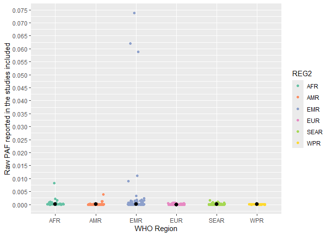
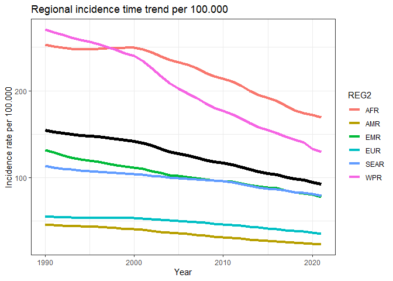

Aflatoxin M1 model - attributable fraction of aflatoxin
================
fbbu6966
2025-10-03

- [Settings](#settings)
- [load datasets](#load-datasets)
- [Cleaning data](#cleaning-data)
- [Conversion](#conversion)
- [Exposure](#exposure)
- [BW](#bw)
- [Hepatitis B dataset](#hepatitis-b-dataset)
- [PAF calculation](#paf-calculation)
- [Graphs](#graphs)


# Settings

``` r

rm(list=ls())

# packages
library(tidyverse)
library(mc2d)
library(dplyr)
library(openxlsx)
library(readxl)
library(devtools)
# install_github("brechtdv/FERG2")
library(FERG2)

# settings
set.seed(123)

nvar <- 1e5
nunc <- 1e3

mean_median_ci <-
  function(x) {
    c(mean = mean(x),
      median = median(x),
      quantile(x, probs = c(0.025, 0.975)))
  }
```

# load datasets

``` r
#milk concentration and consumption
conc_milk <- read.xlsx("aflatoxinM1_exposure_OCT2025.xlsx",sheet = "milk concentration") #799 
cons_milk <- read.xlsx("aflatoxinM1_exposure_OCT2025.xlsx",sheet = "milk consumption") #81

```

# Cleaning data

``` r
#remove NA
conc_milk$FLAG <- 0
conc_milk$FLAG <- if_else(is.na(conc_milk$SOURCE_YEAR),
                          5,
                          conc_milk$FLAG)

# Additional data cleaning
Territories <- read_xlsx("Territories_R_20250221.xlsx")
Flag_territory <- unlist(Territories)

conc_milk$FLAG_REF_LOCATION <- as.integer(apply(sapply(Flag_territory, function(x) grepl(x, conc_milk$REF_LOCATION, ignore.case = TRUE)), 1, any))
conc_milk$FLAG_REF_NOTES <- as.integer(apply(sapply(Flag_territory, function(x) grepl(x, conc_milk$REF_NOTES, ignore.case = TRUE)), 1, any))
conc_milk$FLAG_SOURCE_TITLE <- as.integer(apply(sapply(Flag_territory, function(x) grepl(x, conc_milk$SOURCE_TITLE, ignore.case = TRUE)), 1, any))
conc_milk$FLAG_TERRITORY <- if_else(conc_milk$FLAG_REF_LOCATION + conc_milk$FLAG_REF_NOTES + conc_milk$FLAG_SOURCE_TITLE >=1 , 1, 0)

conc_milk$FLAG <- if_else(conc_milk$FLAG_TERRITORY == 1 & conc_milk$FLAG == 0, 
                           1, 
                           conc_milk$FLAG)

cons_milk$FLAG <- 0
cons_milk$FLAG_REF_LOCATION <- as.integer(apply(sapply(Flag_territory, function(x) grepl(x, cons_milk$REF_LOCATION, ignore.case = TRUE)), 1, any))
cons_milk$FLAG_REF_NOTES <- as.integer(apply(sapply(Flag_territory, function(x) grepl(x, cons_milk$REF_NOTES, ignore.case = TRUE)), 1, any))
cons_milk$FLAG_SOURCE_TITLE <- as.integer(apply(sapply(Flag_territory, function(x) grepl(x, cons_milk$SOURCE_TITLE, ignore.case = TRUE)), 1, any))
cons_milk$FLAG_TERRITORY <- if_else(cons_milk$FLAG_REF_LOCATION + cons_milk$FLAG_REF_NOTES + cons_milk$FLAG_SOURCE_TITLE >=1 , 1, 0)

cons_milk$FLAG <- if_else(cons_milk$FLAG_TERRITORY == 1 & cons_milk$FLAG == 0, 
                          1, 
                          cons_milk$FLAG)

# Brazil has two consumption data points, only keep latest
cons_milk$FLAG <- if_else(cons_milk$REF_LOCATION == "Brazil" & cons_milk$REF_YEAR_START == 2009,
                          5,
                          cons_milk$FLAG)

```

# Conversion

``` r
#Convert all units to micrograms per gram
# Create a conversion lookup table
conversion_factors <- list(
  "ng/g" = 1,
  "ng/g (mg/kg)" = 1,
  "ng/g (ug/kg(" = 1,
  "ng/g (ug/kg)" = 1,
  "ppb" =1 ,
  "ppb (ug/kg)" = 1,
  "ug/kg" = 1,
  "ug/kg " = 1,
  "ug/kg (ng/g)" = 1,
  "ug/kg (ng/g)" =1
  )

units_to_exclude <- "0"


# Apply the function to each row
conc_milk$converted_value <- 0

for(i in 1:nrow(conc_milk)) {
  value = as.numeric(conc_milk$VALUE_MEAN[i])
  unit = conc_milk$VALUE_UNIT[i]
  
  if (unit %in% names(conversion_factors)) {
    conc_milk$converted_value[i] <- value * as.numeric(conversion_factors[[unit]])
  } else {
    conc_milk$converted_value[i] <- value
  }
  
}

# Save files for listed studies
conc_milk$ROW_ID <- c(1:nrow(conc_milk))
cons_milk_flag <- cons_milk
cons_milk_flag$FLAG<-factor(cons_milk_flag$FLAG,
                            levels=c(0,1,2,3,4,5,6, 7),
                            labels=c("Keep data", "Data part of non WHO member states", "No WHO REG2 given",
                                     "Year before 1990", "yi can't be calcualted", "TF choice to remove",
                                     "Excluded by preliminary checks", "Excluded in data cleaning"))
```

# Exposure

``` r
Exposure <- c()
Exposure_df <- c()

for( j in unique(cons_milk$REF_LOCATION)){
  
  country <- j
  
  if(is.na(country)) {
    print("Country is NA")
  } else { 
  
  iso3 <- cons_milk[cons_milk$REF_LOCATION %in% country & cons_milk == 0,]
  
  concentration <- conc_milk[conc_milk$REF_LOCATION %in% country & conc_milk$FLAG == 0,]
  consumption <- cons_milk[as.character(cons_milk$REF_LOCATION) %in% country & cons_milk$FLAG == 0,]
  
  if(nrow(concentration) > 0) {
    
    for( k in 1:nrow(concentration)) {
      Exposu <- consumption$VALUE_MEAN * concentration[k,"VALUE_MEAN"] * 1000 #need to multiply with 1000 here!!!!
      Exposure <- cbind.data.frame(country,k,Exposu, concentration[k, "SOURCE_ID"], concentration[k, "ROW_ID"],
                                   concentration[k, "SOURCE_YEAR"], concentration[k, "REF_YEAR_START"], 
                                   concentration[k, "REF_YEAR_END"], concentration[k, "REF_NOTES"],
                                   concentration[k, "REF_LOCATION_ISO3"])
      colnames(Exposure) <- c("country","k","value", "SOURCE_ID", "ROW_ID", "SOURCE_YEAR", "REF_YEAR_START", "REF_YEAR_END",
                              "REF_NOTES", "REF_LOCATION_ISO3")
      Exposure_df <- rbind.data.frame(Exposure_df,Exposure)
      
    }
    
  } else {
  k <- 0 
  Exposure <- cbind.data.frame(country,k,0,NA,NA,iso3[1, "SOURCE_YEAR"],
                               iso3[1, "REF_YEAR_START"],iso3[1, "REF_YEAR_END"],
                               NA, iso3[1, "REF_LOCATION_ISO3"])
  colnames(Exposure) <- c("country","k","value", "SOURCE_ID", "ROW_ID", "SOURCE_YEAR", "REF_YEAR_START", "REF_YEAR_END",
                          "REF_NOTES", "REF_LOCATION_ISO3")
  Exposure_df <- rbind.data.frame(Exposure_df,Exposure)  
    
    }
  }
  }

Exposure_milk <- Exposure_df
```

# BW

``` r
# Load BW
# Read BW data set and take mean by region
BW <-  read.xlsx("BW.xlsx", sheet = 1)
BW <- BW[1:35,c(1,8)]
names(BW) <- c("REGION","BW")
BW <- subset(BW, !(is.na(BW) | BW == "NO BW" | BW == "NA"))
BW <- BW %>%
  mutate(REG2 = case_when(
    REGION == "AFRO" ~ "AFR", 
    REGION ==  "EMRO" ~ "EMR",
    REGION ==  "EURO" ~ "EUR",
    REGION == "PAHO" ~ "AMR",
    REGION == "SEARO" ~"SEAR", 
    REGION == "WIPRO" ~"WPR"))
BW$BW <- as.numeric(BW$BW)
BW <- aggregate(BW ~ REG2, BW, mean)

# Add information about geography to data points
Exposure_milk$ISO3 <- Exposure_milk$REF_LOCATION_ISO3
Exposure_milk$REG2 <- FERG2:::countries$REG2[match(Exposure_milk$ISO3, FERG2:::countries$ISO3)]
Exposure_milk$SUB2 <- FERG2:::countries$SUB2[match(Exposure_milk$ISO3, FERG2:::countries$ISO3)]

Exposure_milk$REG2 <- if_else(is.na(Exposure_milk$REG2),
                         "EUR", 
                         Exposure_milk$REG2)

Exposure_milk <- left_join(Exposure_milk, BW)

# Calculate the exposure per BW per day
Exposure_milk$a_c <- Exposure_milk$value/Exposure_milk$BW

# LV: not all studies have a reference year, this is filled in:
Exposure_milk$REF_YEAR_START <- if_else(is.na(Exposure_milk$REF_YEAR_START),
                                        Exposure_milk$SOURCE_YEAR - 1,
                                        Exposure_milk$REF_YEAR_START)
Exposure_milk$REF_YEAR_END <- if_else(is.na(Exposure_milk$REF_YEAR_END),
                                        Exposure_milk$SOURCE_YEAR - 1,
                                        Exposure_milk$REF_YEAR_END)

```

# Hepatitis B dataset

``` r
HepatitisB_all <- read.csv("IHME-GBD_2021_DATA-d82d2181-1.csv")
location_exclude <-
  c("American Samoa",
    "Bermuda",
    "Greenland",
    "Guam",
    "Northern Mariana Islands",
    "Palestine",
    "Puerto Rico",
    "Taiwan (Province of China)",
    "Tokelau",
    "United States Virgin Islands")
HepatitisB_all <- subset(HepatitisB_all, !(location_name %in% location_exclude))

HepatitisB_all <-
  dplyr::mutate(
    HepatitisB_all,
    location_name = case_when(
      location_name == "Turkey" ~ "Turkiye",
      location_name == "Congo" ~ "Congo (the)",
      location_name == "Democratic Republic of the Congo" ~ "Congo (the Democratic Republic of the)",
      location_name == "Dominican Republic" ~ "Dominican Republic (the)",
      location_name == "Gambia" ~ "Gambia (the)",
      location_name == "Lao People's Democratic Republic" ~ "Lao People's Dem. Republic",
      location_name == "Micronesia (Federated States of)" ~ "Micronesia (Fed. States of)",
      location_name == "Democratic People's Republic of Korea" ~ "Korea (the Democratic People's Republic of)",
      location_name == "Republic of Korea" ~ "Korea (the republic of)",
      location_name == "Arab Republic of Egypt" ~ "Egypt",
      location_name == "Argentine Republic" ~ "Argentina",
      location_name == "Bolivarian Republic of Venezuela" ~ "Venezuela (Bolivarian Republic of)",
      location_name == "Czech Republic" ~ "Czechia",
      location_name == "Democratic Republic of Sao Tome and Principe" ~ "Sao Tome and Principe",
      location_name == "Democratic Republic of Timor-Leste" ~ "Timor-Leste",
      location_name == "Democratic Socialist Republic of Sri Lanka" ~ "Sri Lanka",
      location_name == "Eastern Republic of Uruguay" ~ "Uruguay",
      location_name == "Federal Democratic Republic of Ethiopia" ~ "Ethiopia",
      location_name == "Federal Democratic Republic of Nepal" ~ "Nepal",
      location_name == "Federal Republic of Germany" ~ "Germany",
      location_name == "Federal Republic of Nigeria" ~ "Nigeria",
      location_name == "Federal Republic of Somalia" ~ "Somalia",
      location_name == "Federated States of Micronesia" ~ "Micronesia (Fed. States of)",
      location_name == "Federative Republic of Brazil" ~ "Brazil",
      location_name == "French Republic" ~ "France",
      location_name == "Gabonese Republic" ~ "Gabon",
      location_name == "Grand Duchy of Luxembourg" ~ "Luxembourg",
      location_name == "Hashemite Kingdom of Jordan" ~ "Jordan",
      location_name == "Independent State of Papua New Guinea" ~ "Papua New Guinea",
      location_name == "Independent State of Samoa" ~ "Samoa",
      location_name == "Islamic Republic of Afghanistan" ~ "Afghanistan",
      location_name == "Islamic Republic of Iran" ~ "Iran (Islamic Republic of)",
      location_name == "Islamic Republic of Mauritania" ~ "Mauritania",
      location_name == "Islamic Republic of Pakistan" ~ "Pakistan",
      location_name == "Kingdom of Bahrain" ~ "Bahrain",
      location_name == "Kingdom of Belgium" ~ "Belgium",
      location_name == "Kingdom of Bhutan" ~ "Bhutan",
      location_name == "Kingdom of Cambodia" ~ "Cambodia",
      location_name == "Kingdom of Denmark" ~ "Denmark",
      location_name == "Kingdom of Eswatini" ~ "Eswatini",
      location_name == "Kingdom of Lesotho" ~ "Lesotho",
      location_name == "Kingdom of Morocco" ~ "Morocco",
      location_name == "Kingdom of Norway" ~ "Norway",
      location_name == "Kingdom of Saudi Arabia" ~ "Saudi Arabia",
      location_name == "Kingdom of Spain" ~ "Spain",
      location_name == "Kingdom of Sweden" ~ "Sweden",
      location_name == "Kingdom of Thailand" ~ "Thailand",
      location_name == "Kingdom of the Netherlands" ~ "Netherlands",
      location_name == "Kingdom of Tonga" ~ "Tonga",
      location_name == "Kyrgyz Republic" ~ "Kyrgyzstan",
      location_name == "Lebanese Republic" ~ "Lebanon",
      location_name == "People's Democratic Republic of Algeria" ~ "Algeria",
      location_name == "People's Republic of Bangladesh" ~ "Bangladesh",
      location_name == "People's Republic of China" ~ "China",
      location_name == "Plurinational State of Bolivia" ~ "Bolivia (Plurinational State of)",
      location_name == "Portuguese Republic" ~ "Portugal",
      location_name == "Republic of the Congo" ~ "Congo (the)",
      location_name == "Republic of the Gambia" ~ "Gambia (the)",
      location_name == "Republic of the Marshall Islands" ~ "Marshall Islands",
      location_name == "Republic of the Niger" ~ "Niger",
      location_name == "Republic of the Philippines" ~ "Philippines",
      location_name == "Republic of the Union of Myanmar" ~ "Myanmar",
      location_name == "Republic of Turkey" ~ "Turkiye",
      location_name == "Republic of Moldova" ~ "Republic of Moldova",
      location_name == "Commonwealth of Dominica" ~ "Dominica",
      substr(location_name, 1, 12) == "Republic of " ~ substr(location_name,13, str_count(location_name)),
      location_name == "Principality of Andorra" ~ "Andorra",
      location_name == "Principality of Monaco" ~ "Monaco",
      location_name == "Slovak Republic" ~ "Slovakia",
      location_name == "Socialist Republic of Viet Nam" ~ "Viet Nam",
      substr(location_name, 1, 9) == "State of " ~ substr(location_name, 10, str_count(location_name)),
      location_name == "Sultanate of Oman" ~ "Oman",
      location_name == "Swiss Confederation" ~ "Switzerland",
      location_name == "Togolese Republic" ~ "Togo",
      location_name == "Union of the Comoros" ~ "Comoros",
      location_name == "United Kingdom of Great Britain and Northern Ireland" ~ "United Kingdom",
      location_name == "United Mexican States" ~ "Mexico",
      location_name == "Commonwealth of the Bahamas" ~ "Bahamas",
      location_name == "Hellenic Republic" ~ "Greece",
      .default = location_name
    ))

HepatitisB_all$ISO3 <-
  FERG2:::countries$ISO3[
    match(HepatitisB_all$location_name, FERG2:::countries$COUNTRY)]

HepatitisB <- subset(HepatitisB_all, metric_name == "Rate")

HepatitisB$p_c <- HepatitisB$val/100000
HepatitisB <- HepatitisB[,c("ISO3","location_name","year","p_c")]

```

# PAF calculation

``` r
#JECFA Potency Factors (per ng/kg bw/day)
b <- 0.0017 #HBV neg individuals
hxb <- 0.0269 #HBV pos individuals
h <- hxb/b

#Background HCC mortality rate from Guangxi cohort standardized to the global population 
# Liver cancer data 
Livercancer <- read.csv("IHME-GBD_2021_DATA-eda575f4-1.csv")
Livercancer <- subset(Livercancer, !(location_name %in% location_exclude))

Livercancer <-
  dplyr::mutate(
    Livercancer,
    location_name = case_when(
      location_name == "Turkey" ~ "Turkiye",
      location_name == "Congo" ~ "Congo (the)",
      location_name == "Democratic Republic of the Congo" ~ "Congo (the Democratic Republic of the)",
      location_name == "Dominican Republic" ~ "Dominican Republic (the)",
      location_name == "Gambia" ~ "Gambia (the)",
      location_name == "Lao People's Democratic Republic" ~ "Lao People's Dem. Republic",
      location_name == "Micronesia (Federated States of)" ~ "Micronesia (Fed. States of)",
      location_name == "Democratic People's Republic of Korea" ~ "Korea (the Democratic People's Republic of)",
      location_name == "Republic of Korea" ~ "Korea (the republic of)",
      location_name == "Arab Republic of Egypt" ~ "Egypt",
      location_name == "Argentine Republic" ~ "Argentina",
      location_name == "Bolivarian Republic of Venezuela" ~ "Venezuela (Bolivarian Republic of)",
      location_name == "Czech Republic" ~ "Czechia",
      location_name == "Democratic Republic of Sao Tome and Principe" ~ "Sao Tome and Principe",
      location_name == "Democratic Republic of Timor-Leste" ~ "Timor-Leste",
      location_name == "Democratic Socialist Republic of Sri Lanka" ~ "Sri Lanka",
      location_name == "Eastern Republic of Uruguay" ~ "Uruguay",
      location_name == "Federal Democratic Republic of Ethiopia" ~ "Ethiopia",
      location_name == "Federal Democratic Republic of Nepal" ~ "Nepal",
      location_name == "Federal Republic of Germany" ~ "Germany",
      location_name == "Federal Republic of Nigeria" ~ "Nigeria",
      location_name == "Federal Republic of Somalia" ~ "Somalia",
      location_name == "Federated States of Micronesia" ~ "Micronesia (Fed. States of)",
      location_name == "Federative Republic of Brazil" ~ "Brazil",
      location_name == "French Republic" ~ "France",
      location_name == "Gabonese Republic" ~ "Gabon",
      location_name == "Grand Duchy of Luxembourg" ~ "Luxembourg",
      location_name == "Hashemite Kingdom of Jordan" ~ "Jordan",
      location_name == "Independent State of Papua New Guinea" ~ "Papua New Guinea",
      location_name == "Independent State of Samoa" ~ "Samoa",
      location_name == "Islamic Republic of Afghanistan" ~ "Afghanistan",
      location_name == "Islamic Republic of Iran" ~ "Iran (Islamic Republic of)",
      location_name == "Islamic Republic of Mauritania" ~ "Mauritania",
      location_name == "Islamic Republic of Pakistan" ~ "Pakistan",
      location_name == "Kingdom of Bahrain" ~ "Bahrain",
      location_name == "Kingdom of Belgium" ~ "Belgium",
      location_name == "Kingdom of Bhutan" ~ "Bhutan",
      location_name == "Kingdom of Cambodia" ~ "Cambodia",
      location_name == "Kingdom of Denmark" ~ "Denmark",
      location_name == "Kingdom of Eswatini" ~ "Eswatini",
      location_name == "Kingdom of Lesotho" ~ "Lesotho",
      location_name == "Kingdom of Morocco" ~ "Morocco",
      location_name == "Kingdom of Norway" ~ "Norway",
      location_name == "Kingdom of Saudi Arabia" ~ "Saudi Arabia",
      location_name == "Kingdom of Spain" ~ "Spain",
      location_name == "Kingdom of Sweden" ~ "Sweden",
      location_name == "Kingdom of Thailand" ~ "Thailand",
      location_name == "Kingdom of the Netherlands" ~ "Netherlands",
      location_name == "Kingdom of Tonga" ~ "Tonga",
      location_name == "Kyrgyz Republic" ~ "Kyrgyzstan",
      location_name == "Lebanese Republic" ~ "Lebanon",
      location_name == "People's Democratic Republic of Algeria" ~ "Algeria",
      location_name == "People's Republic of Bangladesh" ~ "Bangladesh",
      location_name == "People's Republic of China" ~ "China",
      location_name == "Plurinational State of Bolivia" ~ "Bolivia (Plurinational State of)",
      location_name == "Portuguese Republic" ~ "Portugal",
      location_name == "Republic of the Congo" ~ "Congo (the)",
      location_name == "Republic of the Gambia" ~ "Gambia (the)",
      location_name == "Republic of the Marshall Islands" ~ "Marshall Islands",
      location_name == "Republic of the Niger" ~ "Niger",
      location_name == "Republic of the Philippines" ~ "Philippines",
      location_name == "Republic of the Union of Myanmar" ~ "Myanmar",
      location_name == "Republic of Turkey" ~ "Turkiye",
      location_name == "Republic of Moldova" ~ "Republic of Moldova",
      location_name == "Commonwealth of Dominica" ~ "Dominica",
      substr(location_name, 1, 12) == "Republic of " ~ substr(location_name,13, str_count(location_name)),
      location_name == "Principality of Andorra" ~ "Andorra",
      location_name == "Principality of Monaco" ~ "Monaco",
      location_name == "Slovak Republic" ~ "Slovakia",
      location_name == "Socialist Republic of Viet Nam" ~ "Viet Nam",
      substr(location_name, 1, 9) == "State of " ~ substr(location_name, 10, str_count(location_name)),
      location_name == "Sultanate of Oman" ~ "Oman",
      location_name == "Swiss Confederation" ~ "Switzerland",
      location_name == "Togolese Republic" ~ "Togo",
      location_name == "Union of the Comoros" ~ "Comoros",
      location_name == "United Kingdom of Great Britain and Northern Ireland" ~ "United Kingdom",
      location_name == "United Mexican States" ~ "Mexico",
      location_name == "Commonwealth of the Bahamas" ~ "Bahamas",
      location_name == "Hellenic Republic" ~ "Greece",
      .default = location_name
    ))

Livercancer$ISO3 <-
  FERG2:::countries$ISO3[
    match(Livercancer$location_name, FERG2:::countries$COUNTRY)]

Livercancer$HCC_s <- Livercancer$val
Livercancer <- Livercancer[,c("ISO3","year","HCC_s")]

# Excess risk due to AFM1
Exposure_milk$year <- round(rowMeans(cbind(Exposure_milk$REF_YEAR_START, Exposure_milk$REF_YEAR_END)))

Exposure_milk <- merge(Exposure_milk, HepatitisB, by.x = c("ISO3", "year"),
                       by.y = c("ISO3", "year"), all.x=TRUE)
Exposure_milk <- merge(Exposure_milk, Livercancer, by.x = c("ISO3", "year"),
                       by.y = c("ISO3", "year"), all.x=TRUE)
Exposure_milk$HCC_ac <- b * Exposure_milk$a_c*(1-Exposure_milk$p_c + (Exposure_milk$p_c * h))
Exposure_milk$Excess_risk <- Exposure_milk$HCC_ac
# 7 observations without excess risk as study data from 2022

Exposure_milk$PAF_ac <- Exposure_milk$Excess_risk/Exposure_milk$HCC_s
```

# Graphs

``` r
# Exposure
ggplot(Exposure_milk, aes(x = REG2, y = PAF_ac, group = REG2, color=REG2)) +
  geom_jitter(width = 0.2, height = 0, ) +  # Adds random noise horizontally for better distribution
  stat_summary(fun.min = function(z) { quantile(z, 0.25) },
               fun.max = function(z) { quantile(z, 0.75) },
               fun = median, geom = "pointrange", color = "black", size = 0.5) +
  labs(y = "Raw PAF reported in the studies included", x = "WHO Region") +
  scale_color_brewer(palette = "Set2")+
  scale_y_continuous(limits = c(0, max(Exposure_milk$PAF_ac)),
                     breaks = pretty(Exposure_milk$PAF_ac, n = 20))
```

<!-- -->

``` r
# Hepatitis B (update 27 may 2025)
pop <- FERG2:::pop
pop$REG2 <- FERG2:::countries$REG2[match(pop$ISO3, FERG2:::countries$ISO3)]
pop <- subset(pop, YEAR < 2022)
HepatitisB_NR <- subset(HepatitisB_all, metric_name == "Number")
HepatitisB_NR$YEAR <- HepatitisB_NR$year
HepatitisB_NR <- HepatitisB_NR[,c("ISO3","location_name","YEAR","val")]
HepatitisB_NR$REG2 <- FERG2:::countries$REG2[match(HepatitisB_NR$ISO3, FERG2:::countries$ISO3)]
HepatitisB_NR_REG <- aggregate(val ~ YEAR + REG2, HepatitisB_NR, sum)
HepatitisB_NR_REG$POP <- aggregate(POP ~ YEAR + REG2, pop, sum)$POP
HepatitisB_NR_REG$RT <- 1e5 * HepatitisB_NR_REG$val / HepatitisB_NR_REG$POP
HepatitisB_NR_GLB <- aggregate(val ~ YEAR, HepatitisB_NR, sum)
HepatitisB_NR_GLB$POP <- aggregate(POP ~ YEAR, pop, sum)$POP
HepatitisB_NR_GLB$RT <- 1e5 * HepatitisB_NR_GLB$val / HepatitisB_NR_GLB$POP
HepatitisB_NR_GLB$REG2 <- "GLOBAL"
ggplot(HepatitisB_NR_REG, aes(x = YEAR, y = RT, group = REG2)) +
  geom_line(aes(col = REG2), linewidth = 1.5) +
  geom_line(data = HepatitisB_NR_GLB, linewidth = 2) +
  theme_bw() +
  ggtitle("Regional incidence time trend per 100.000") +
  xlab("Year") +
  ylab("Incidence rate per 100.000")
```

<!-- -->
