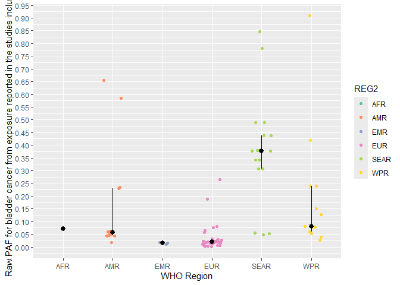
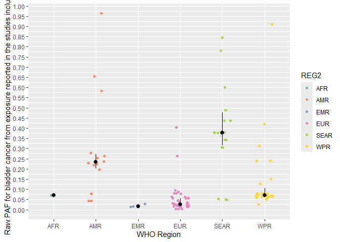
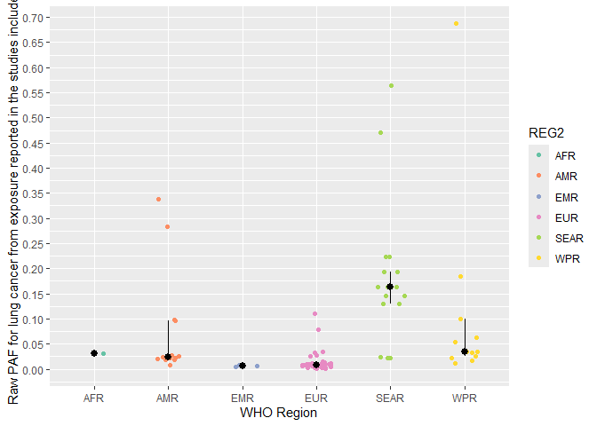
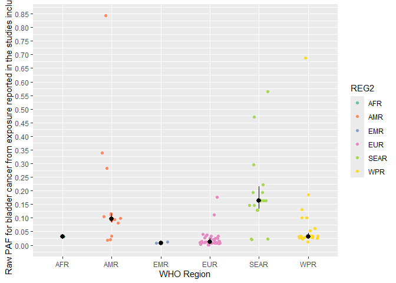
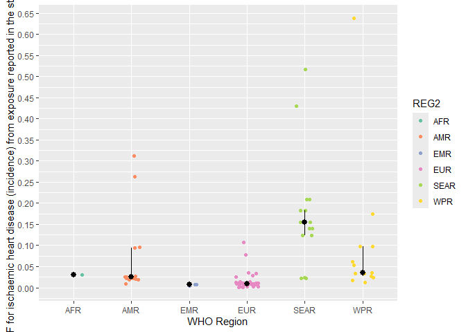
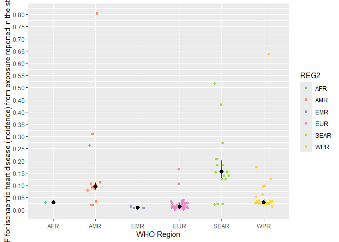
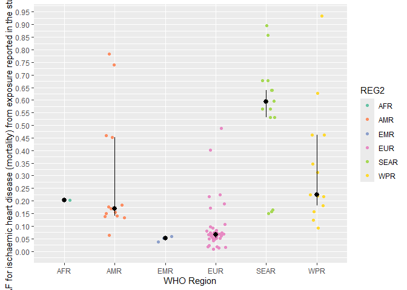
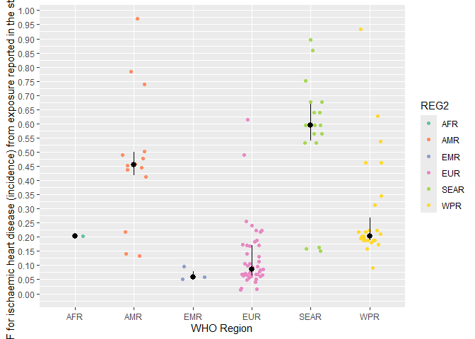
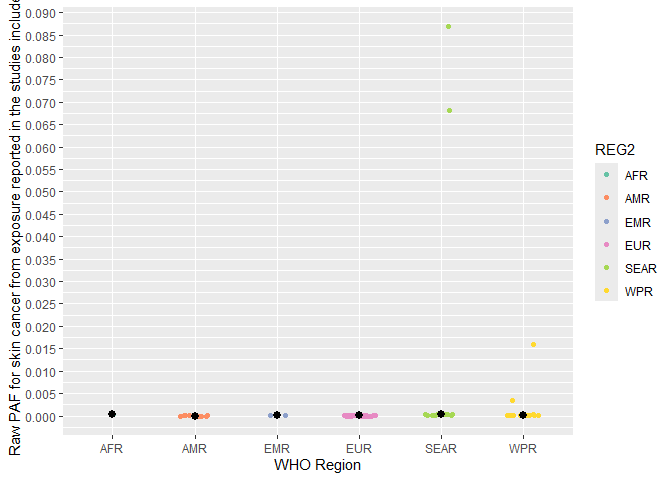

Arsenic model - attributable fraction of arsenic by health state
================
fbbu6966
2025-10-10

- [Packages](#packages)
- [Settings](#settings)
- [PAF arsenic](#paf-arsenic)
- [Dietary exposure database](#dietary-exposure-database)
- [Data cleaning](#data-cleaning)
- [BW](#bw)
- [Geographical information](#geographical-information)
- [Measurments cleaning](#measurments-cleaning)
- [Disputed territories](#disputed-territories)
- [Dataset Antonio with corrections regarding to
  age](#dataset-antonio-with-corrections-regarding-to-age)
- [BLADDER CANCER - POPULATION ATTRIBUTABLE
  FRACTION](#bladder-cancer---population-attributable-fraction)
- [LUNG CANCER - POPULATION ATTRIBUTABLE
  FRACTION](#lung-cancer---population-attributable-fraction)
- [ISCHAEMIC HEART DISEASE - POPULATION ATTRIBUTABLE FRACTION for
  incidence and
  mortality](#ischaemic-heart-disease---population-attributable-fraction-for-incidence-and-mortality)
- [Skin CANCER - POPULATION ATTRIBUTABLE
  FRACTION](#skin-cancer---population-attributable-fraction)

``` r
# iAs model - PAF for lung, bladder and skin cancer and IHD
# Based on model in FERG1 - Oberoi et al (2019)

```

# Packages

``` r
# packages
library(tidyverse)
library(mc2d)
library(xlsx)
library(readxl)
library(devtools)
#install_github("brechtdv/FERG2")
library(FERG2)
library(data.table)
```

# Settings

``` r
set.seed(123)#123

nunc <- 1 #1e+03
nvar <- 1e+05

mean_median_ci <-
  function(x) {
    c(mean = mean(x),
      median = median(x),
      quantile(x, probs = c(0.025, 0.975)))
  }
```

# PAF arsenic

``` r
Exposure_raw <- list()
Exposure_raw$BC <- read_excel("PAF_ias_BC_20251505.xlsx")
Exposure_raw$LC <- read_excel("PAF_ias_LC_20251505.xlsx")
Exposure_raw$SC <- read_excel("PAF_ias_SC_20251505.xlsx")
Exposure_raw$IHD <- read_excel("PAF_ias_IHD_20251505.xlsx")
```

# Dietary exposure database

``` r
# load exposure data - to derive population mean dietary cadmium exposure across all age groups (ug/kg bw/day)
Exposure <- read.xlsx("iAs_dietaryexposure_250904.xlsx",sheetName = "iAs in food", stringsAsFactors=FALSE) #799
Exposure <- subset(Exposure, !is.na(SOURCE_ID))

Exposure$VALUE_MEAN <- as.character(Exposure$VALUE_MEAN)
Exposure$VALUE_MEAN <- as.numeric(Exposure$VALUE_MEAN)
```

# Data cleaning

``` r
# Year is missing for certain studies, so this is added
Exposure <- Exposure %>%
  mutate(
    REF_YEAR_START = case_when(
      is.na(REF_YEAR_START) & !is.na(REF_YEAR_END) ~ REF_YEAR_END,
      is.na(REF_YEAR_START) & is.na(REF_YEAR_END) ~ SOURCE_YEAR - 1,
      .default = REF_YEAR_START),
    REF_YEAR_END = case_when(
      is.na(REF_YEAR_END) & !is.na(REF_YEAR_START) ~ REF_YEAR_START,
      is.na(REF_YEAR_END) & is.na(REF_YEAR_START) ~ SOURCE_YEAR - 1,
      .default = REF_YEAR_END))

#only including studies labelled with reporting exposure (BROAD_FOOD_CATEGORIES ="Total intake")

Exposure <- Exposure %>%
  mutate(FLAG = case_when(
    BROAD_FOOD_CATEGORIES == "Total intake" ~ 0,
    .default = 5
  ))
# filter(BROAD_FOOD_CATEGORIES == "Total intake") #113 obs

for(i in 1:nrow(Exposure)) {
  if (is.na(Exposure$VALUE_MEAN[i])) {
    Exposure$VALUE_MEAN[i] <- Exposure$VALUE_MEDIAN[i]
    
  } else {}
  
}

Exposure$FLAG <- if_else(!complete.cases(Exposure$VALUE_MEAN) & Exposure$FLAG == 0,
                         5,
                         Exposure$FLAG)

#Need to correct exposure unit given in ug/day to per bw assuming a 70 or 60 kg bw! (divide by 70 or 60 respectively)
# Read BW data set and take mean by region
```

# BW

``` r
BW <-  read.xlsx("BW.xlsx", sheetIndex = 1)
BW <- BW[1:35,c(1,8)]
names(BW) <- c("REGION","BW")
BW <- subset(BW, !(is.na(BW) | BW == "NO BW" | BW == "NA"))
BW <- BW %>%
  mutate(REG2 = case_when(
    REGION == "AFRO" ~ "AFR",
    REGION ==  "EMRO" ~ "EMR",
    REGION ==  "EURO" ~ "EUR",
    REGION == "PAHO" ~ "AMR",
    REGION == "SEARO" ~"SEAR",
    REGION == "WIPRO" ~"WPR"))
BW$BW <- as.numeric(BW$BW)
BW <- aggregate(BW ~ REG2, BW, mean)
```

# Geographical information

``` r
# Add information about geography to data points
Exposure$ISO3 <- Exposure$REF_LOCATION_ISO3
Exposure$REG2 <- FERG2:::countries$REG2[match(Exposure$ISO3, FERG2:::countries$ISO3)]
Exposure$SUB2 <- FERG2:::countries$SUB2[match(Exposure$ISO3, FERG2:::countries$ISO3)]

Exposure$REG2 <- if_else(is.na(Exposure$REG2),
                         "EUR",
                         Exposure$REG2)

Exposure <- left_join(Exposure, BW)
```

# Measurments cleaning

``` r
Exposure <- Exposure %>%
  mutate(VALUE = case_when(
      UNITS_MEASUREMENTS %in% c("\u00B5g/day", "\u03BCg/day") ~ VALUE_MEAN / BW,
      UNITS_MEASUREMENTS %in% c("\u00B5g/person/day", "\u03BCg/person/day") ~ VALUE_MEAN / BW,
      UNITS_MEASUREMENTS == "mg/day" ~ VALUE_MEAN / BW,
      .default = VALUE_MEAN))

units_to_exclude <- c(
  "mg/kg dw",
  "\u00B5g/g ww",   # µ as micro sign (U+00B5)
  "\u03BCg/g ww"    # μ as Greek small mu (U+03BC)
)

Exposure$FLAG <- if_else(Exposure$UNITS_MEASUREMENTS %in% units_to_exclude & Exposure$FLAG == 0,
                         5,
                         Exposure$FLAG)

# Exposure <- Exposure[!Exposure$UNITS_MEASUREMENTS %in% units_to_exclude, ]

conversion_factors <- list(
  "mg/kg/day" = 1000,
  "mg/day" = 1000
)

# Apply the function to each row
Exposure$converted_value <- 0

for(i in 1:nrow(Exposure)) {
  value = Exposure$VALUE[i]
  unit = Exposure$UNITS_MEASUREMENTS[i]
  
  if (unit %in% names(conversion_factors)) {
    Exposure$converted_value[i] <- value * as.numeric(conversion_factors[[unit]])
    print(unit)
  } else {
    Exposure$converted_value[i] <- value
  }
  
}
```

# Disputed territories

``` r
# Flag disputed territories
Territories <- read_xlsx("Territories_R_20250221.xlsx")
Flag_territory <- unlist(Territories)

Exposure$FLAG_REF_LOCATION <- as.integer(apply(sapply(Flag_territory, function(x) grepl(x, Exposure$REF_LOCATION, ignore.case = TRUE)), 1, any))
Exposure$FLAG_REF_NOTES <- as.integer(apply(sapply(Flag_territory, function(x) grepl(x, Exposure$REF_NOTES, ignore.case = TRUE)), 1, any))
Exposure$FLAG_SOURCE_TITLE <- as.integer(apply(sapply(Flag_territory, function(x) grepl(x, Exposure$SOURCE_TITLE, ignore.case = TRUE)), 1, any))
Exposure$FLAG_TERRITORY <- if_else(Exposure$FLAG_REF_LOCATION + Exposure$FLAG_REF_NOTES + Exposure$FLAG_SOURCE_TITLE >=1 , 1, 0)

Exposure$FLAG <- if_else(Exposure$FLAG_TERRITORY == 1 & Exposure$FLAG == 0,
                         1,
                         Exposure$FLAG)

```

# Dataset Antonio with corrections regarding to age

``` r
Arsenic_corrected <- read.xlsx("iAs Exposure_26082025.xlsx", sheetIndex = 1)
# For study 38, 176 year was not yet added in file Antonio which makes merging not possible
Arsenic_corrected$REF_YEAR_START <- if_else(Arsenic_corrected$SOURCE_ID %in% c(38, 176),
                                            2015,
                                            Arsenic_corrected$REF_YEAR_START)
Arsenic_corrected$REF_YEAR_END <- if_else(Arsenic_corrected$SOURCE_ID %in% c(38, 176),
                                          2015,
                                          Arsenic_corrected$REF_YEAR_END)
# For study 39, 173 year was not yet added in file Antonio which makes merging not possible
Arsenic_corrected$REF_YEAR_START <- if_else(Arsenic_corrected$SOURCE_ID %in% c(39, 173),
                                            2010,
                                            Arsenic_corrected$REF_YEAR_START)
Arsenic_corrected$REF_YEAR_END <- if_else(Arsenic_corrected$SOURCE_ID %in% c(39, 173),
                                          2010,
                                          Arsenic_corrected$REF_YEAR_END)
# For study 40 year was not yet added in file Antonio which makes merging not possible
Arsenic_corrected$REF_YEAR_START <- if_else(Arsenic_corrected$SOURCE_ID == 40,
                                            2018,
                                            Arsenic_corrected$REF_YEAR_START)
Arsenic_corrected$REF_YEAR_END <- if_else(Arsenic_corrected$SOURCE_ID == 40,
                                          2018,
                                          Arsenic_corrected$REF_YEAR_END)
# For study 43 year was not yet added in file Antonio which makes merging not possible
Arsenic_corrected$REF_YEAR_START <- if_else(Arsenic_corrected$SOURCE_ID == 43,
                                            2013,
                                            Arsenic_corrected$REF_YEAR_START)
Arsenic_corrected$REF_YEAR_END <- if_else(Arsenic_corrected$SOURCE_ID == 43,
                                          2013,
                                          Arsenic_corrected$REF_YEAR_END)
# For study 44, 45 year was not yet added in file Antonio which makes merging not possible
Arsenic_corrected$REF_YEAR_START <- if_else(Arsenic_corrected$SOURCE_ID %in% c(44, 45),
                                            2012,
                                            Arsenic_corrected$REF_YEAR_START)
Arsenic_corrected$REF_YEAR_END <- if_else(Arsenic_corrected$SOURCE_ID %in% c(44, 45),
                                          2012,
                                          Arsenic_corrected$REF_YEAR_END)
# For study 56 year was not yet added in file Antonio which makes merging not possible
Arsenic_corrected$REF_YEAR_START <- if_else(Arsenic_corrected$SOURCE_ID == 56,
                                            2016,
                                            Arsenic_corrected$REF_YEAR_START)
Arsenic_corrected$REF_YEAR_END <- if_else(Arsenic_corrected$SOURCE_ID == 56,
                                          2016,
                                          Arsenic_corrected$REF_YEAR_END)
# For study 59 year was not yet added in file Antonio which makes merging not possible
Arsenic_corrected$REF_YEAR_START <- if_else(Arsenic_corrected$SOURCE_ID == 59,
                                            2014,
                                            Arsenic_corrected$REF_YEAR_START)
Arsenic_corrected$REF_YEAR_END <- if_else(Arsenic_corrected$SOURCE_ID == 59,
                                          2014,
                                          Arsenic_corrected$REF_YEAR_END)
# For study 62 year was not yet added in file Antonio which makes merging not possible
Arsenic_corrected$REF_YEAR_START <- if_else(Arsenic_corrected$SOURCE_ID == 62,
                                            2008,
                                            Arsenic_corrected$REF_YEAR_START)
Arsenic_corrected$REF_YEAR_END <- if_else(Arsenic_corrected$SOURCE_ID == 62,
                                          2008,
                                          Arsenic_corrected$REF_YEAR_END)
# For study 183 year was not yet added in file Antonio which makes merging not possible
Arsenic_corrected$REF_YEAR_START <- if_else(Arsenic_corrected$SOURCE_ID == 183,
                                            2017,
                                            Arsenic_corrected$REF_YEAR_START)
Arsenic_corrected$REF_YEAR_END <- if_else(Arsenic_corrected$SOURCE_ID == 183,
                                          2017,
                                          Arsenic_corrected$REF_YEAR_END)
# For study 184 year was not yet added in file Antonio which makes merging not possible
Arsenic_corrected$REF_YEAR_START <- if_else(Arsenic_corrected$SOURCE_ID == 184,
                                            2020,
                                            Arsenic_corrected$REF_YEAR_START)
Arsenic_corrected$REF_YEAR_END <- if_else(Arsenic_corrected$SOURCE_ID == 184,
                                          2020,
                                          Arsenic_corrected$REF_YEAR_END)
# Additional studies from country consultation
Arsenic_additional <- subset(Arsenic_corrected, SOURCE_ID %in% c("CC_1", "CC_2", "CC_3"))
Arsenic_additional$REF_LOC_LEVEL <- "National" # typo
Arsenic_additional <- Arsenic_additional %>% 
  mutate(
    ISO3 = case_when(
      REF_LOCATION == "United Kingdom" ~ "GBR",
      .default = REF_LOCATION_ISO3),
    SUB2 = case_when(
      REF_LOCATION == "United Kingdom" ~ "EURA",
      REF_LOCATION == "Japan" ~ "WPRA",
      REF_LOCATION == "New Zealand" ~ "WPRA",
      .default = SUB2),
    BW = case_when(
      REF_LOCATION == "United Kingdom" ~ 69.37500,
      REF_LOCATION == "Japan" ~ 60.40000,
      REF_LOCATION == "New Zealand" ~ 60.40000,
      .default = BW))

Arsenic_corrected <- Arsenic_corrected[!is.na(Arsenic_corrected$SOURCE_ID),
                                       c("SOURCE_ID", "REF_YEAR_START", "REF_YEAR_END",
                                         "REF_LOC_LEVEL", "REF_LOCATION", "REF_LOCATION_ISO3",
                                         "REF_SEX", "REF_AGE_START", "REF_AGE_END", "REG2",
                                         "SUB2", "BW", "VALUE", "converted_value", "ratio_ages",
                                         "age_corrected.", "observations")]

Exposure_clean <- subset(Exposure, FLAG == 0)
# Study 36 regional study, REF_LOCATION_ISO3 not matching in both files
Exposure_clean$REF_LOCATION_ISO3 <- if_else(Exposure_clean$SOURCE_ID == 36, "", Exposure_clean$REF_LOCATION_ISO3)
Exposure_clean$SOURCE_ID <- as.character(Exposure_clean$SOURCE_ID)
Arsenic_corrected_extra <- right_join(Exposure_clean, Arsenic_corrected)

Arsenic_corrected_extra <- subset(Arsenic_corrected_extra, is.na(SOURCE_AUTHOR))

# Study 50 all flagged because data from Hong Kong
Exposure_clean <- left_join(Exposure_clean, Arsenic_corrected) # 92 observations with no missing corrected values

# Add additional data from country consultation
Arsenic_additional$NA. <- NULL
Arsenic_additional$REF_AGE_START.1 <- NULL
Arsenic_additional$REF_AGE_END.1 <- NULL
Arsenic_additional$FLAG <- 0
Arsenic_additional$FLAG_REF_LOCATION <- 0
Arsenic_additional$FLAG_REF_NOTES <- 0
Arsenic_additional$FLAG_SOURCE_TITLE <- 0
Arsenic_additional$FLAG_TERRITORY <- 0
Exposure_clean <- rbind(Exposure_clean, Arsenic_additional)
Exposure_clean$observations <- if_else(is.na(Exposure_clean$observations),
                                       "INCLUDE",
                                       Exposure_clean$observations)
Exposure_clean$FLAG <- if_else(Exposure_clean$observations == "to be deleted",
                               5,
                               Exposure_clean$FLAG)
# 92 data points to include, check if NZL needs conversion

# recombine exposure clean and exposure
Exposure$SOURCE_ID <- as.character(Exposure$SOURCE_ID)
Exposure <- bind_rows(subset(Exposure, FLAG != 0), Exposure_clean)
Exposure$converted_value_before <- Exposure$converted_value
Exposure$converted_value <- Exposure$age_corrected.# adjustment Antonio used as value to calculate PAF by health state

```

# BLADDER CANCER - POPULATION ATTRIBUTABLE FRACTION

``` r
# US EPA polynomial trendlines
# y = 0,0046x2 + 0,0053x

Exposure$ER_bladder <- (Exposure$converted_value^2)*0.0046+ 0.0053*Exposure$converted_value

# US lifetime probability of bladder cancer (Risk) at 0 exposure, R_0 (provided in US EPA report)
R_0_bladder <- 0.01897

Exposure$RR_bladder <- Exposure$ER_bladder * ((1-R_0_bladder)/R_0_bladder) + 1

Exposure$PAF_bladder <- (Exposure$RR_bladder-1)/Exposure$RR_bladder

ggplot(subset(Exposure, FLAG == 0), aes(x = REG2, y = PAF_bladder, group = REG2, color=REG2)) +
  geom_jitter(width = 0.2, height = 0, ) +  # Adds random noise horizontally for better distribution
  stat_summary(fun.min = function(z) { quantile(z, 0.25) },
               fun.max = function(z) { quantile(z, 0.75) },
               fun = median, geom = "pointrange", color = "black", size = 0.5) +
  labs(y = "Raw PAF for bladder cancer from exposure reported in the studies included", x = "WHO Region") +
  scale_color_brewer(palette = "Set2")+
  scale_y_continuous(limits = c(0, max(subset(Exposure, FLAG == 0)$PAF_bladder)),
                     breaks = pretty(subset(Exposure, FLAG == 0)$PAF_bladder, n = 20))
```

<!-- -->

``` r
ggplot(Exposure_raw$BC, aes(x = REG2, y = PAF, group = REG2, color=REG2)) +
  geom_jitter(width = 0.2, height = 0, ) +  # Adds random noise horizontally for better distribution
  stat_summary(fun.min = function(z) { quantile(z, 0.25) },
               fun.max = function(z) { quantile(z, 0.75) },
               fun = median, geom = "pointrange", color = "black", size = 0.5) +
  labs(y = "Raw PAF for bladder cancer from exposure reported in the studies included", x = "WHO Region") +
  scale_color_brewer(palette = "Set2")+
  scale_y_continuous(limits = c(0, max(Exposure_raw$BC$PAF)),
                     breaks = pretty(Exposure_raw$BC$PAF, n = 20))
```

<!-- -->

# LUNG CANCER - POPULATION ATTRIBUTABLE FRACTION

``` r
# US EPA polynomial trendlines
# y = 0.0025x2 + 0.0077x

Exposure$ER_lung <- (Exposure$converted_value^2)*0.0025+ 0.0077*Exposure$converted_value

#US lifetime probability of lung cancer (Risk) at 0 exposure, R_0 (provided in US EPA report)
R_0_lung <- 0.0571

Exposure$RR_lung <- Exposure$ER_lung * ((1-R_0_lung)/R_0_lung) + 1

Exposure$PAF_lung <- (Exposure$RR_lung-1)/Exposure$RR_lung

ggplot(subset(Exposure, FLAG == 0), aes(x = REG2, y = PAF_lung, group = REG2, color=REG2)) +
  geom_jitter(width = 0.2, height = 0, ) +  # Adds random noise horizontally for better distribution
  stat_summary(fun.min = function(z) { quantile(z, 0.25) },
               fun.max = function(z) { quantile(z, 0.75) },
               fun = median, geom = "pointrange", color = "black", size = 0.5) +
  labs(y = "Raw PAF for lung cancer from exposure reported in the studies included", x = "WHO Region") +
  scale_color_brewer(palette = "Set2")+
  scale_y_continuous(limits = c(0, max(subset(Exposure, FLAG == 0)$PAF_lung)),
                     breaks = pretty(subset(Exposure, FLAG == 0)$PAF_lung, n = 20))
```

<!-- -->

``` r
ggplot(Exposure_raw$LC, aes(x = REG2, y = PAF, group = REG2, color=REG2)) +
  geom_jitter(width = 0.2, height = 0, ) +  # Adds random noise horizontally for better distribution
  stat_summary(fun.min = function(z) { quantile(z, 0.25) },
               fun.max = function(z) { quantile(z, 0.75) },
               fun = median, geom = "pointrange", color = "black", size = 0.5) +
  labs(y = "Raw PAF for bladder cancer from exposure reported in the studies included", x = "WHO Region") +
  scale_color_brewer(palette = "Set2")+
  scale_y_continuous(limits = c(0, max(Exposure_raw$LC$PAF)),
                     breaks = pretty(Exposure_raw$LC$PAF, n = 20))
```

<!-- -->

# ISCHAEMIC HEART DISEASE - POPULATION ATTRIBUTABLE FRACTION for incidence and mortality

``` r
# US EPA polynomial trendlines
# Incidence: y = 0,0187x2 + 0,0878x

Exposure$ER_heartinc <- (Exposure$converted_value^2)*0.0187+ 0.0878*Exposure$converted_value

#US lifetime probability of IHD (Risk) at 0 exposure, R_0 (provided in US EPA report)
R_0_heartinc <- 0.4

Exposure$RR_heartinc <- Exposure$ER_heartinc * ((1-R_0_heartinc)/R_0_heartinc) + 1

Exposure$PAF_heartinc <- (Exposure$RR_heartinc-1)/Exposure$RR_heartinc

ggplot(subset(Exposure, FLAG == 0), aes(x = REG2, y = PAF_heartinc, group = REG2, color=REG2)) +
  geom_jitter(width = 0.2, height = 0, ) +  # Adds random noise horizontally for better distribution
  stat_summary(fun.min = function(z) { quantile(z, 0.25) },
               fun.max = function(z) { quantile(z, 0.75) },
               fun = median, geom = "pointrange", color = "black", size = 0.5) +
  labs(y = "Raw PAF for ischaemic heart disease (incidence) from exposure reported in the studies included", x = "WHO Region") +
  scale_color_brewer(palette = "Set2")+
  scale_y_continuous(limits = c(0, max(subset(Exposure, FLAG == 0)$PAF_heartinc)),
                     breaks = pretty(subset(Exposure, FLAG == 0)$PAF_heartinc, n = 20))
```

<!-- -->

``` r
ggplot(Exposure_raw$IHD, aes(x = REG2, y = PAF_i, group = REG2, color=REG2)) +
  geom_jitter(width = 0.2, height = 0, ) +  # Adds random noise horizontally for better distribution
  stat_summary(fun.min = function(z) { quantile(z, 0.25) },
               fun.max = function(z) { quantile(z, 0.75) },
               fun = median, geom = "pointrange", color = "black", size = 0.5) +
  labs(y = "Raw PAF for ischaemic heart disease (incidence) from exposure reported in the studies included", x = "WHO Region") +
  scale_color_brewer(palette = "Set2")+
  scale_y_continuous(limits = c(0, max(Exposure_raw$IHD$PAF_i)),
                     breaks = pretty(Exposure_raw$IHD$PAF_i, n = 20))
```

<!-- -->

``` r
# Mortality:  y = 0,022x2 + 0,0181x

Exposure$ER_heartmrt <- (Exposure$converted_value^2)*0.0187+ 0.0878*Exposure$converted_value

# US lifetime probability of IHD (Risk) at 0 exposure, R_0 (provided in US EPA report)
R_0_heartmrt <- 0.077

Exposure$RR_heartmrt <- Exposure$ER_heartmrt * ((1-R_0_heartmrt)/R_0_heartmrt) + 1

Exposure$PAF_heartmrt <- (Exposure$RR_heartmrt-1)/Exposure$RR_heartmrt

ggplot(subset(Exposure, FLAG == 0), aes(x = REG2, y = PAF_heartmrt, group = REG2, color=REG2)) +
  geom_jitter(width = 0.2, height = 0, ) +  # Adds random noise horizontally for better distribution
  stat_summary(fun.min = function(z) { quantile(z, 0.25) },
               fun.max = function(z) { quantile(z, 0.75) },
               fun = median, geom = "pointrange", color = "black", size = 0.5) +
  labs(y = "Raw PAF for ischaemic heart disease (mortality) from exposure reported in the studies included", x = "WHO Region") +
  scale_color_brewer(palette = "Set2")+
  scale_y_continuous(limits = c(0, max(subset(Exposure, FLAG == 0)$PAF_heartmrt)),
                     breaks = pretty(subset(Exposure, FLAG == 0)$PAF_heartmrt, n = 20))
```

<!-- -->

``` r
ggplot(Exposure_raw$IHD, aes(x = REG2, y = PAF_f, group = REG2, color=REG2)) +
  geom_jitter(width = 0.2, height = 0, ) +  # Adds random noise horizontally for better distribution
  stat_summary(fun.min = function(z) { quantile(z, 0.25) },
               fun.max = function(z) { quantile(z, 0.75) },
               fun = median, geom = "pointrange", color = "black", size = 0.5) +
  labs(y = "Raw PAF for ischaemic heart disease (incidence) from exposure reported in the studies included", x = "WHO Region") +
  scale_color_brewer(palette = "Set2")+
  scale_y_continuous(limits = c(0, max(Exposure_raw$IHD$PAF_f)),
                     breaks = pretty(Exposure_raw$IHD$PAF_f, n = 20))
```

<!-- -->

# Skin CANCER - POPULATION ATTRIBUTABLE FRACTION

``` r
# Add skin cancer data
Skincancer <- read.csv("IHME-GBD_2021_DATA-a49582d3-1.csv")
location_exclude <-
  c("American Samoa",
    "Bermuda",
    "Greenland",
    "Guam",
    "Northern Mariana Islands",
    "Palestine",
    "Puerto Rico",
    "Taiwan (Province of China)",
    "Tokelau",
    "United States Virgin Islands")
Skincancer <- subset(Skincancer, !(location_name %in% location_exclude))

Skincancer <-
  dplyr::mutate(
    Skincancer,
    location_name = case_when(
      location_name == "Turkey" ~ "Turkiye",
      location_name == "Congo" ~ "Congo (the)",
      location_name == "Democratic Republic of the Congo" ~ "Congo (the Democratic Republic of the)",
      location_name == "Dominican Republic" ~ "Dominican Republic (the)",
      location_name == "Gambia" ~ "Gambia (the)",
      location_name == "Lao People's Democratic Republic" ~ "Lao People's Dem. Republic",
      location_name == "Micronesia (Federated States of)" ~ "Micronesia (Fed. States of)",
      location_name == "Democratic People's Republic of Korea" ~ "Korea (the Democratic People's Republic of)",
      location_name == "Republic of Korea" ~ "Korea (the republic of)",
      location_name == "Arab Republic of Egypt" ~ "Egypt",
      location_name == "Argentine Republic" ~ "Argentina",
      location_name == "Bolivarian Republic of Venezuela" ~ "Venezuela (Bolivarian Republic of)",
      location_name == "Czech Republic" ~ "Czechia",
      location_name == "Democratic Republic of Sao Tome and Principe" ~ "Sao Tome and Principe",
      location_name == "Democratic Republic of Timor-Leste" ~ "Timor-Leste",
      location_name == "Democratic Socialist Republic of Sri Lanka" ~ "Sri Lanka",
      location_name == "Eastern Republic of Uruguay" ~ "Uruguay",
      location_name == "Federal Democratic Republic of Ethiopia" ~ "Ethiopia",
      location_name == "Federal Democratic Republic of Nepal" ~ "Nepal",
      location_name == "Federal Republic of Germany" ~ "Germany",
      location_name == "Federal Republic of Nigeria" ~ "Nigeria",
      location_name == "Federal Republic of Somalia" ~ "Somalia",
      location_name == "Federated States of Micronesia" ~ "Micronesia (Fed. States of)",
      location_name == "Federative Republic of Brazil" ~ "Brazil",
      location_name == "French Republic" ~ "France",
      location_name == "Gabonese Republic" ~ "Gabon",
      location_name == "Grand Duchy of Luxembourg" ~ "Luxembourg",
      location_name == "Hashemite Kingdom of Jordan" ~ "Jordan",
      location_name == "Independent State of Papua New Guinea" ~ "Papua New Guinea",
      location_name == "Independent State of Samoa" ~ "Samoa",
      location_name == "Islamic Republic of Afghanistan" ~ "Afghanistan",
      location_name == "Islamic Republic of Iran" ~ "Iran (Islamic Republic of)",
      location_name == "Islamic Republic of Mauritania" ~ "Mauritania",
      location_name == "Islamic Republic of Pakistan" ~ "Pakistan",
      location_name == "Kingdom of Bahrain" ~ "Bahrain",
      location_name == "Kingdom of Belgium" ~ "Belgium",
      location_name == "Kingdom of Bhutan" ~ "Bhutan",
      location_name == "Kingdom of Cambodia" ~ "Cambodia",
      location_name == "Kingdom of Denmark" ~ "Denmark",
      location_name == "Kingdom of Eswatini" ~ "Eswatini",
      location_name == "Kingdom of Lesotho" ~ "Lesotho",
      location_name == "Kingdom of Morocco" ~ "Morocco",
      location_name == "Kingdom of Norway" ~ "Norway",
      location_name == "Kingdom of Saudi Arabia" ~ "Saudi Arabia",
      location_name == "Kingdom of Spain" ~ "Spain",
      location_name == "Kingdom of Sweden" ~ "Sweden",
      location_name == "Kingdom of Thailand" ~ "Thailand",
      location_name == "Kingdom of the Netherlands" ~ "Netherlands",
      location_name == "Kingdom of Tonga" ~ "Tonga",
      location_name == "Kyrgyz Republic" ~ "Kyrgyzstan",
      location_name == "Lebanese Republic" ~ "Lebanon",
      location_name == "People's Democratic Republic of Algeria" ~ "Algeria",
      location_name == "People's Republic of Bangladesh" ~ "Bangladesh",
      location_name == "People's Republic of China" ~ "China",
      location_name == "Plurinational State of Bolivia" ~ "Bolivia (Plurinational State of)",
      location_name == "Portuguese Republic" ~ "Portugal",
      location_name == "Republic of the Congo" ~ "Congo (the)",
      location_name == "Republic of the Gambia" ~ "Gambia (the)",
      location_name == "Republic of the Marshall Islands" ~ "Marshall Islands",
      location_name == "Republic of the Niger" ~ "Niger",
      location_name == "Republic of the Philippines" ~ "Philippines",
      location_name == "Republic of the Union of Myanmar" ~ "Myanmar",
      location_name == "Republic of Turkey" ~ "Turkiye",
      location_name == "Republic of Moldova" ~ "Republic of Moldova",
      location_name == "Commonwealth of Dominica" ~ "Dominica",
      substr(location_name, 1, 12) == "Republic of " ~ substr(location_name,13, str_count(location_name)),
      location_name == "Principality of Andorra" ~ "Andorra",
      location_name == "Principality of Monaco" ~ "Monaco",
      location_name == "Slovak Republic" ~ "Slovakia",
      location_name == "Socialist Republic of Viet Nam" ~ "Viet Nam",
      substr(location_name, 1, 9) == "State of " ~ substr(location_name, 10, str_count(location_name)),
      location_name == "Sultanate of Oman" ~ "Oman",
      location_name == "Swiss Confederation" ~ "Switzerland",
      location_name == "Togolese Republic" ~ "Togo",
      location_name == "Union of the Comoros" ~ "Comoros",
      location_name == "United Kingdom of Great Britain and Northern Ireland" ~ "United Kingdom",
      location_name == "United Mexican States" ~ "Mexico",
      location_name == "Commonwealth of the Bahamas" ~ "Bahamas",
      location_name == "Hellenic Republic" ~ "Greece",
      .default = location_name
    ))

Skincancer$ISO3 <-
  FERG2:::countries$ISO3[
    match(Skincancer$location_name, FERG2:::countries$COUNTRY)]

Skincancer$INC_skin <- Skincancer$val
Skincancer <- Skincancer[,c("ISO3","location_name","year","INC_skin")]

Exposure$year <- round(rowMeans(cbind(Exposure$REF_YEAR_START, Exposure$REF_YEAR_END)))
Exposure <- merge(Exposure, Skincancer, by.x = c("ISO3", "year"),
                  by.y = c("ISO3", "year"), all.x=TRUE)

Exposure$ER_skin <- Exposure$converted_value * 0.00175
Exposure$PAF_skin <- Exposure$ER_skin/Exposure$INC_skin

ggplot(subset(Exposure, FLAG == 0), aes(x = REG2, y = PAF_skin, group = REG2, color=REG2)) +
  geom_jitter(width = 0.2, height = 0, ) +  # Adds random noise horizontally for better distribution
  stat_summary(fun.min = function(z) { quantile(z, 0.25) },
               fun.max = function(z) { quantile(z, 0.75) },
               fun = median, geom = "pointrange", color = "black", size = 0.5) +
  labs(y = "Raw PAF for skin cancer from exposure reported in the studies included", x = "WHO Region") +
  scale_color_brewer(palette = "Set2")+
  scale_y_continuous(limits = c(0, max(subset(Exposure, FLAG == 0)$PAF_skin)),
                     breaks = pretty(subset(Exposure, FLAG == 0)$PAF_skin, n = 20))
```

<!-- -->

``` r
ggplot(subset(Exposure, FLAG == 0 & PAF_skin <= 1), aes(x = REG2, y = PAF_skin, group = REG2, color=REG2)) +
  geom_jitter(width = 0.2, height = 0, ) +  # Adds random noise horizontally for better distribution
  stat_summary(fun.min = function(z) { quantile(z, 0.25) },
               fun.max = function(z) { quantile(z, 0.75) },
               fun = median, geom = "pointrange", color = "black", size = 0.5) +
  labs(y = "Raw PAF for skin cancer from exposure reported in the studies included", x = "WHO Region") +
  scale_color_brewer(palette = "Set2")+
  scale_y_continuous(limits = c(0, max(subset(Exposure, FLAG == 0 & PAF_skin <= 1)$PAF_skin)),
                     breaks = pretty(subset(Exposure, FLAG == 0 & PAF_skin <= 1)$PAF_skin, n = 20))
```

<!-- -->

