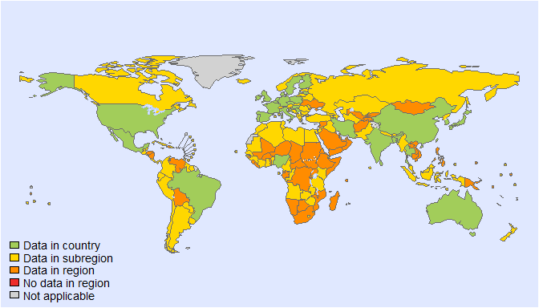
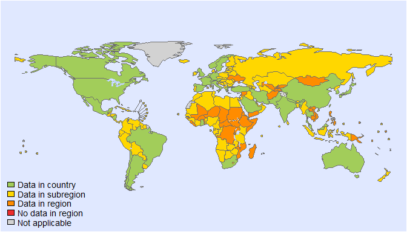
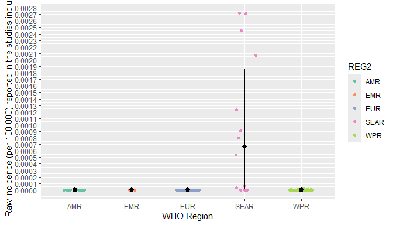
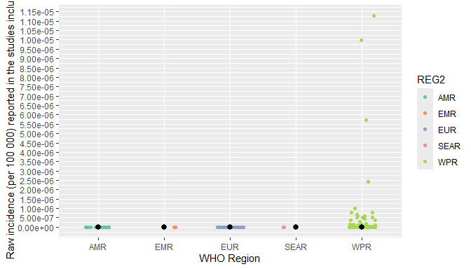

Cadmium model - incidence per 100,000 of CKD stage 4 and 5
================
LoVa3397
2026-01-15

- [Settings](#settings)
- [Exposure](#exposure)
- [BW](#BW)
- [Geography and merge BW & exposure](#Geography-and-merge-BW-&-exposure)
- [GFR data](#GFR-data)
- [Calculate raw incidences](#Calculate-raw-incidences)

``` r
# Cadmium model - incidence per 100,000 of CKD stage 4 and 5
# Based on model in FERG1 - Zang et al (2019)

```

# Settings

``` r 
# Packages
library(tidyverse)
library(mc2d)
# library(xlsx)
library(readxl)
library(writexl)
library(devtools)
#install_github("brechtdv/FERG2")
library(FERG2)
library(sf)

# settings 
set.seed(123)#123

nunc <- 1 #1e+03
nvar <- 1e+05

mean_median_ci <-
  function(x) {
    c(mean = mean(x),
      median = median(x),
      quantile(x, probs = c(0.025, 0.975)))
  }

Territories <- read_xlsx("Territories_R_20250221.xlsx")
Flag_territory <- unlist(Territories)
```
# Exposure

``` r 
# load exposure data - to derive population mean dietary cadmium exposure across all age groups (ug/kg bw/day)

Exposure <- read.csv("Data-Cd.csv", comment.char="#", stringsAsFactors=TRUE)
Exposure_CC <- read_xlsx("Data-Cd-CCDATA.xlsx")
Exposure_CC$REF_UNIT <- "\xa6\xccg/(kg bw\xa1\xa4day)"
Exposure <- rbind(Exposure, Exposure_CC)

# Changes asked by Lea in e-mail 07/02: Remove following studies: 120, 312, 313, 347, 563 and 652
Exposure$FLAG <- 0
Exposure$FLAG <- if_else(Exposure$SOURCE_ID %in% c(120, 312, 313, 347, 563, 652),
                         5,
                         Exposure$FLAG)

#including studies labelled with reporting exposure (REF_DATA_TYPE = exposure)

Exposure$FLAG <- if_else(Exposure$REF_DATA_TYPE != "Exposure" & Exposure$FLAG == 0,
                         5,
                         Exposure$FLAG)

#including studies labelled with reporting for whole diet (REF_FOOD_TYPE = all, total etc)
variables_FT <- c("24-h Food duplicates" , 
                  "24-h duplicates of food", 
                  "24-h food-duplicate samples", 
                  "All", 
                  "All food", 
                  "daily food rations (DRFs)", 
                  "daily food rations", 
                  "Food",
                  "Food and drinking (tap water)",
                  "Regular",  
                  "regular diet", 
                  "Regular OFC", 
                  "Total",
                  "Total Cd exposure",
                  "Total daily Cd intake from foods", 
                  "Total Diet",
                  "total dietary",
                  "Total food",
                  "Total food considered",
                  "Total food group",
                  "Total food study",
                  "Total for fall", 
                  "Total for spring",
                  "Total intake",
                  "Total intake (TI)",
                  "Total:NHEXAS"
)

Exposure$FLAG <- if_else(!Exposure$REF_FOOD_TYPE %in% variables_FT & Exposure$FLAG == 0, 
                         5,
                         Exposure$FLAG)


#excluding studies only reporting on single foodgroups
Exposure$SOURCE_ID <- as.factor(Exposure$SOURCE_ID)
variables_ID <- c("30", 
                  "49", 
                  "60", 
                  "91", 
                  "95", 
                  "110", 
                  "118", 
                  "153",
                  "188",
                  "189",
                  "198",
                  "205",
                  "211",
                  "224",
                  "237",
                  "259",
                  "267",
                  "296",
                  "298",
                  "299",
                  "335",
                  "342",
                  "365",
                  "366",
                  "369",
                  "370",
                  "376",
                  "378",
                  "407",
                  "427",
                  "429",
                  "432",
                  "459",
                  "465",
                  "529",
                  "545",
                  "584",
                  "591",
                  "595",
                  "599",
                  "610",
                  "612",
                  "617",
                  "636",
                  "638",
                  "640",
                  "659",
                  "665",
                  "670",
                  "691",
                  "718"
)

Exposure$FLAG <- if_else(Exposure$SOURCE_ID %in% variables_ID & Exposure$FLAG == 0, 
                         5,
                         Exposure$FLAG)

for(i in 1:nrow(Exposure)) {
  if (is.na(Exposure$VALUE_MEAN[i])) {
    Exposure$VALUE_MEAN[i] <- Exposure$VALUE_MEDIAN[i]
    
  } else {}
  
}

Exposure$REF_AGE_START <- as.numeric(Exposure$REF_AGE_START)
Exposure$REF_AGE_END <- as.numeric(Exposure$REF_AGE_END)
Exposure$OPT_MEAN_AGE1 <- (Exposure$REF_AGE_START+Exposure$REF_AGE_END)/2 #new column for mean age

for(i in 1:nrow(Exposure)) {
  if (is.na(Exposure$OPT_MEAN_AGE[i])) {
    Exposure$OPT_MEAN_AGE[i] <- Exposure$OPT_MEAN_AGE1[i]
    
  } else {}
  
}

Exposure$FLAG <- if_else(!complete.cases(Exposure$VALUE_MEAN) & Exposure$FLAG == 0, 
                         5,
                         Exposure$FLAG)

```

# BW 

``` r
#Need to correct exposure unit given in ug/day to per bw assuming a 70 or 60 kg bw! (divide by 70 or 60 respectively)
# Read BW data set and take mean by region
BW <-  read_excel("BW.xlsx")
BW$FLAG <- 0
BW$FLAG_TERRITORY  <- as.integer(apply(sapply(Flag_territory, function(x) grepl(x, BW$Dataset, ignore.case = TRUE)), 1, any))
# None of them are in flagged territory, so all can be kept
BW <- BW[1:35,c(1,8)]
names(BW) <- c("REGION","BW")
BW <- subset(BW, !(is.na(BW) | BW == "NO BW" | BW == "NA"))
BW <- BW %>%
  mutate(REG2 = case_when(
    REGION == "AFRO" ~ "AFR", 
    REGION ==  "EMRO" ~ "EMR",
    REGION ==  "EURO" ~ "EUR",
    REGION == "PAHO" ~ "AMR",
    REGION == "SEARO" ~"SEAR", 
    REGION == "WIPRO" ~"WPR"))
BW$BW <- as.numeric(BW$BW)
BW <- aggregate(BW ~ REG2, BW, mean)
```

# Geography and merge BW & exposure 

``` r
# Add information about geography to data points
Exposure$ISO3 <- Exposure$REF_LOCATION_ISO3
Exposure$REG2 <- FERG2:::countries$REG2[match(Exposure$ISO3, FERG2:::countries$ISO3)]
Exposure$SUB2 <- FERG2:::countries$SUB2[match(Exposure$ISO3, FERG2:::countries$ISO3)]

Exposure$REG2 <- if_else(is.na(Exposure$REG2) & Exposure$FLAG == 0,
                         "EUR", 
                         Exposure$REG2)

Exposure <- left_join(Exposure, BW)

#correct individual record IDs: 
Exposure$REF_UNIT <- if_else(Exposure$Record_ID %in% c(1801, 1802, 2424, 15128, 15383),
                             "\xa6\xccg/day",
                             Exposure$REF_UNIT)

##Source ID 312 and 313 = Greenland - super high exposures! Include or delete? 
##Source ID 563 = US - super high exposure in record 12494, record 12492 cannot be refound! Include or delete? 
# Additional corrections requested by Lea e-mail 07/02
Exposure$REF_UNIT <- if_else(Exposure$SOURCE_ID == 148,
                             "\xa6\xccg/day",
                             Exposure$REF_UNIT)

Exposure$VALUE_MEAN <- as.numeric(Exposure$VALUE_MEAN)
Exposure$VALUE_MEAN <- if_else(Exposure$Record_ID == 5742,
                               0.3629,
                               Exposure$VALUE_MEAN)

Exposure$VALUE_MEAN <- if_else(Exposure$Record_ID == 5777,
                               0.47,
                               Exposure$VALUE_MEAN)

Exposure$FLAG <- if_else(Exposure$FLAG == 0  & Exposure$SOURCE_ID %in% c(120, 312, 313, 347, 563, 652),
                         5,
                         Exposure$FLAG)

Exposure <- Exposure %>%
  mutate(VALUE = case_when(
    REF_UNIT == "\xa6\xccg/day" ~ VALUE_MEAN/BW,
    .default =  VALUE_MEAN))

Exposure$FLAG_REF_LOCATION <- as.integer(apply(sapply(Flag_territory, function(x) grepl(x, Exposure$REF_LOCATION, ignore.case = TRUE)), 1, any))
Exposure$FLAG_REF_NOTES <- as.integer(apply(sapply(Flag_territory, function(x) grepl(x, Exposure$REF_NOTES, ignore.case = TRUE)), 1, any))
Exposure$FLAG_TERRITORY <- if_else(Exposure$FLAG_REF_LOCATION + Exposure$FLAG_REF_NOTES + Exposure$FLAG_SOURCE_TITLE >=1 , 1, 0)

# For Spain 2 studies are flagged, but these should not be flagged (they contain the word saba and are flagged for this reason, but not correct)
Exposure$FLAG_TERRITORY <- if_else(Exposure$SOURCE_ID %in% c(412,414) & Exposure$FLAG_TERRITORY == 1,
                                   0,
                                   Exposure$FLAG_TERRITORY)

Exposure$FLAG <- if_else(Exposure$FLAG_TERRITORY == 1 & Exposure$FLAG == 0, 
                         1, 
                         Exposure$FLAG)

plot_world_imputation(subset(Exposure, FLAG == 0), sub = "SUB2")
```

<!-- -->

# GFR data

``` r
#load GRF data - to derive mean baseline GFR rate, standard deviation and age per country
GFRdata <- read_excel("Selected studies_GFR_lsj_250820.xlsx") # Udpate GFR with one study by country
GFRdata$REF_SAMPLE_SIZE <- as.numeric(GFRdata$REF_SAMPLE_SIZE)
GFRdata$REF_AGE_END <- as.numeric(GFRdata$REF_AGE_END)

GFRdata$OPT_VALUE_SD <- GFRdata$VALUE_SE*sqrt(GFRdata$REF_SAMPLE_SIZE) #convert SE to SD

GFRdata$OPT_VALUE_SD <- GFRdata$VALUE_SE

GFRdata$OPT_MEAN_AGE1 <- (GFRdata$REF_AGE_START+GFRdata$REF_AGE_END)/2 #new column for mean age

# Missing ISO3 codes in GFR data
GFRdata <- GFRdata %>% 
  mutate(REF_LOCATION_ISO3 = case_when(
    REF_LOCATION == "Kuwait" ~ "KWT", 
    REF_LOCATION == "Saudi Arabia" ~ "SAU", 
    REF_LOCATION == "Singapore" ~ "SGP", 
    REF_LOCATION == "South Africa" ~ "ZAF",
    REF_LOCATION == "United Kingdom" ~ "GBR",
    REF_LOCATION == "Germany" ~ "DEU",
    .default = REF_LOCATION_ISO3
  ))

for(i in 1:nrow(GFRdata)) {
  if (is.na(GFRdata$OPT_MEAN_AGE[i])) {
    GFRdata$OPT_MEAN_AGE[i] <- GFRdata$OPT_MEAN_AGE1[i]
    
  } else {}
  
}

GFRdata$FLAG <- 0
GFRdata$FLAG <- if_else(complete.cases(GFRdata$OPT_VALUE_SD, GFRdata$OPT_MEAN_AGE, GFRdata$VALUE_MEAN),
                        GFRdata$FLAG,
                        5)

GFRdata$FLAG <- if_else(GFRdata$OPT_MEAN_AGE >=15 & GFRdata$FLAG == 0,
                        GFRdata$FLAG,
                        5)

GFRdata$FLAG_REF_LOCATION <- as.integer(apply(sapply(Flag_territory, function(x) grepl(x, GFRdata$REF_LOCATION, ignore.case = TRUE)), 1, any))
GFRdata$FLAG_REF_NOTES <- as.integer(apply(sapply(Flag_territory, function(x) grepl(x, GFRdata$REF_NOTES, ignore.case = TRUE)), 1, any))
GFRdata$FLAG_SOURCE_TITLE <- as.integer(apply(sapply(Flag_territory, function(x) grepl(x, GFRdata$SOURCE_TITLE, ignore.case = TRUE)), 1, any))
GFRdata$FLAG_TERRITORY <- if_else(GFRdata$FLAG_REF_LOCATION + GFRdata$FLAG_REF_NOTES + GFRdata$FLAG_SOURCE_TITLE >=1 , 1, 0)

GFRdata$FLAG <- if_else(GFRdata$FLAG_TERRITORY == 1 & GFRdata$FLAG == 0, 
                        1, 
                        GFRdata$FLAG)


#CTTF suggest to derive mean age, GFR and SD for each country based on the extracted data. We can then either derive CKD incidence only for the countries that are represented in both the exposure database and in the GRF database. GFR data for a given country will be applied to each study reporting exposure for a given country.  

# Save datasets used for country files
Exposure_FLAG <- Exposure
Exposure <- subset(Exposure, FLAG == 0)
GFRdata_FLAG <- GFRdata
GFRdata <- subset(GFRdata, FLAG == 0)
GFRdata$ISO3 <- GFRdata$REF_LOCATION_ISO3
plot_world_imputation(subset(GFRdata, FLAG == 0), sub = "SUB2")
```

<!-- -->

# Calculate raw incidences 

``` r
### Select columns GFR #####
GFRdata <- GFRdata[,c("Record_ID", "SOURCE_ID", "SOURCE_AUTHOR", "SOURCE_TITLE", "REF_LOCATION_ISO3", "OPT_MEAN_AGE", "VALUE_MEAN", "OPT_VALUE_SD")]
colnames(GFRdata) <- paste("GFR" ,colnames(GFRdata),sep="_")

#### Derive year of exposure data (mean of start and end year) ####
Exposure$OPT_MEAN_STUDY <- (Exposure$REF_YEAR_START+Exposure$REF_YEAR_END)/2 
Exposure$OPT_MEAN_STUDY[is.na(Exposure$OPT_MEAN_STUDY)] <- 0

# Toxicokinetic model (Amzal et al. 2009)
# Defining t_half - calculating mu and sigma for lognormal distribution describing variability of t_half based on mean and sd obtained from Amzal et al. 2009.
# Consider to keep t_half deterministic with mean = 11.6 years 
sd <- 3
m <- 11.6

var <- log(1+(sd^2/exp(2*log(m))))
sigma <- sqrt(var)

mu <- log(m)-sigma^2/2
x <- seq(0,300,0.01)

t_half <- rlnorm(nvar, meanlog = mu, sdlog = sigma) #years - assume that T_half is variable

# Defining aggregated physiological parameter f_k and elimination factor f_u

fkfu <- 0.005 

# calculating UCd due to dietary cadmium exposure in 10-year age groups from 40-100 years. 
# MODIFICATION  age <- c(40,50,60,70,80,90) #we can redefine agegroups if necessary
age <- c(40,49.5,59.5,69.5,79.5,89.5) 

Exposure <- merge(Exposure, GFRdata, by.x  = c("REF_LOCATION_ISO3"), by.y = c("GFR_REF_LOCATION_ISO3"), all.x = TRUE)

CKD4_CKD5_PROB <- function(exposure, meangfr, sdgfr, agegfr, recordid, iso3){
  set.seed(123)
  
  #### UCD calculation #####
  ucd <- matrix(0,ncol = nvar, nrow = 6)
  for (j in 1:6) {
    c <- (fkfu/log(2)) * exposure * t_half * (1-exp(-(log(2) * age[j])/t_half))/(1-exp(-log(2)/t_half))
    ucd[j,] <- ifelse(c < 1, 1, c)
  }
  
  if(!is.na(meangfr)){
    #### GFR calculation ####
    gfr <- rnorm(nvar, mean = meangfr, sd = sdgfr) # GFR distribution per country 
    gfr_baseline <- gfr - 0.8 * (40-agegfr) #Baseline GFR for populations at age 40
    gfr_age <- matrix(nrow = 6, ncol = nvar) #current gfr in each agegroup based on baseline GFR at 40 - decline in GFR only from age. 
    
    for(l in 1:6){
      
      if(age[l] >= 40){
        gfr_age[l,] <- gfr_baseline - 0.8 * (age[l]-40) #if > 40 years, decline in gfr
      }
      
      if(age[l] < 40){
        gfr_age[l,] <- gfr_baseline #if < 40 years, gfr stays the same
      }
      
    }
    
    
    gfr_age_plus1 <- matrix(nrow = 6, ncol = nvar) #gfr in 1 year  
    
    for(m in 1:6){
      
      if(age[m] >= 40){
        gfr_age_plus1[m,] <- gfr_baseline - 0.8 * (age[m]-39) #if > 40 years, decline in gfr
      }
      
      if(age[m] < 40){
        gfr_age_plus1[m,] <- gfr_baseline #if still < 40 years, gfr stays the same
      }
      
    }
    
    #### Combine GFR and UCD ####
    gfr_cd_age <- gfr_age*(1-0.078*(ucd-1)) #Zang et al (2019) eq. 3
    
    gfr_cd_age_plus1 <- gfr_age_plus1*(1-0.078*(ucd-1)) #Zang et al (2019) eq. 3
    
    #### Probability of CKD stage 4 and 5 ####
    
    # stage 4 CKD defined by a GFR of 15 - 30 ml/min/1.73m^2
    # stage 5 CKD defined by a GFR < 15 ml/min/1.73m^2
    
    # CKD5 probability without Cd exposure in 10 year agegroups 40 - 100 years (only influence from age)
    
    inc_ckd5_age <- matrix(0, nrow = 6, ncol = nvar )
    
    for(i in 1:6){
      prob_ckd5_age <- pnorm(15, gfr_age[i,], sd = sdgfr, lower.tail = T)
      prob_ckd5_age_plus1 <- pnorm(15, gfr_age_plus1[i,], sd = sdgfr, lower.tail = T)
      inc_ckd5_age[i,] <- prob_ckd5_age_plus1 - prob_ckd5_age
    }
    
    
    # CKD5 probability with Cd exposure in 10 year agegroups 40 - 100 years (influence from age and cd)
    
    inc_ckd5_age_cd <- matrix(0, nrow = 6, ncol = nvar)
    
    for(i in 1:6){
      prob_ckd5_age_cd <- pnorm(15, gfr_cd_age[i,], sd = sdgfr, lower.tail = T)
      prob_ckd5_age_cd_plus1 <- pnorm(15, gfr_cd_age_plus1[i,], sd = sdgfr, lower.tail = T)
      inc_ckd5_age_cd[i,] <- prob_ckd5_age_cd_plus1 - prob_ckd5_age_cd
    }
    
    # CKD5 probability only attributable to Cd exposure
    
    inc_ckd5_cd_only <- inc_ckd5_age_cd - inc_ckd5_age
    
    att_inc_rate_ckd5_agegr <- rowMeans(inc_ckd5_cd_only) #attributable mean probability by age group - multiply by 100,000 to get incidence per 100K? 
    
    # CKD4 probability without Cd exposure in 10 year agegroups 40 - 100 years
    
    inc_ckd4_age <- matrix(0, nrow = 6, ncol = nvar)
    
    for(i in 1:6){
      prob_ckd4_age <- pnorm(30, gfr_age[i,], sd = sdgfr, lower.tail = T) - pnorm(15, gfr_age[i,], sd = sdgfr, lower.tail = T)
      prob_ckd4_age_plus1 <- pnorm(30, gfr_age_plus1[i,], sd = sdgfr, lower.tail = T) - pnorm(15, gfr_age_plus1[i,], sd = sdgfr, lower.tail = T)
      inc_ckd4_age[i,] <- prob_ckd4_age_plus1 - prob_ckd4_age
    }
    
    
    # CKD4 probability with Cd exposure in 10 year agegroups 40 - 100 years
    
    inc_ckd4_age_cd <- matrix(0, nrow = 6, ncol = nvar)
    
    for(i in 1:6){
      prob_ckd4_age_cd <- pnorm(30, gfr_cd_age[i,], sd = sdgfr, lower.tail = T) - pnorm(15, gfr_cd_age[i,], sd = sdgfr, lower.tail = T)
      prob_ckd4_age_cd_plus1 <- pnorm(30, gfr_cd_age_plus1[i,], sd = sdgfr, lower.tail = T) - pnorm(15, gfr_cd_age_plus1[i,], sd = sdgfr, lower.tail = T)
      inc_ckd4_age_cd[i,] <- prob_ckd4_age_cd_plus1 - prob_ckd4_age_cd
    }
    
    # CKD4 probability only attributable to Cd exposure
    
    inc_ckd4_cd_only <- inc_ckd4_age_cd - inc_ckd4_age
    
    att_inc_rate_ckd4_agegr <- rowMeans(inc_ckd4_cd_only)  #attributable mean probability by age group - multiply by 100,000 to get incidence per 100K? 
    
    # ADDEd BY HERNAN
    ##############################################################
    #Adjust att_inc_rate_ckd5_agegr and att_inc_rate_ckd4_agegr 
    att_inc_rate_ckd5_agegr[att_inc_rate_ckd5_agegr < 0] <- 0
    att_inc_rate_ckd4_agegr[att_inc_rate_ckd4_agegr < 0] <- 0
  } else { # No GFR data
    #### Track progress ####
    att_inc_rate_ckd4_agegr <- c(NA, NA, NA, NA, NA, NA)
    att_inc_rate_ckd5_agegr <- c(NA, NA, NA, NA, NA, NA)
  }
  
  out <- c(recordid, as.character(iso3), mean_median_ci(ucd), att_inc_rate_ckd4_agegr, att_inc_rate_ckd5_agegr)
  names(out) <- c("Record_ID", "REF_LOCATION_ISO3",
                  "UCD_mean", "UCD_median", "UCD_LWR", "UCD_UPR", 
                  "CKD4_40", "CKD4_50", "CKD4_60", "CKD4_70", "CKD4_80", "CKD4_90",
                  "CKD5_40", "CKD5_50", "CKD5_60", "CKD5_70", "CKD5_80", "CKD5_90")
  return(out)
}

Exposure_all <- Exposure
Exposure <- subset(Exposure, !is.na(GFR_Record_ID))

CKD4_CKD5 <- as.data.frame(do.call(rbind, mapply(CKD4_CKD5_PROB, exposure = Exposure$VALUE,
                                   meangfr = Exposure$GFR_VALUE_MEAN, sdgfr = Exposure$GFR_OPT_VALUE_SD, agegfr = Exposure$GFR_OPT_MEAN_AGE, 
                                   recordid = Exposure$Record_ID, iso3 = Exposure$REF_LOCATION_ISO3, SIMPLIFY = FALSE)))
CKD4_CKD5$Record_ID <- as.integer(CKD4_CKD5$Record_ID)
Exposure$REF_LOCATION_ISO3 <- as.character(Exposure$REF_LOCATION_ISO3)
Exposure <- merge(Exposure, CKD4_CKD5, by = c("Record_ID", "REF_LOCATION_ISO3"))

ggplot(Exposure , aes(x = REG2, y = as.numeric(CKD4_40), group = REG2, color=REG2)) +
  geom_jitter(width = 0.2, height = 0, ) +  # Adds random noise horizontally for better distribution
  stat_summary(fun.min = function(z) { quantile(z, 0.25) },
               fun.max = function(z) { quantile(z, 0.75) },
               fun = median, geom = "pointrange", color = "black", size = 0.5) +
  labs(y = "Raw incidence (per 100 000) reported in the studies included", x = "WHO Region") +
  scale_color_brewer(palette = "Set2")+
  scale_y_continuous(limits = c(0, max(as.numeric(Exposure$CKD4_40))),
                     breaks = pretty(as.numeric(Exposure$CKD4_40), n = 20))
```

<!-- -->

``` r
Studies_remove <- c(2212, 2438, 4525, 4530, 4679, 5912, 6467, 6471, 12492, 12737,
                    12738, 12739, 12740, 12741, 12742, 2743, 12744, 12745, 12746,
                    12747, 12748, 13704, 13705, 13706, 13707, 13708, 13709, 13710,
                    13711, 13712, 13713, 13714, 13715, 13716, 13717, 13718, 13719,
                    13720, 13721, 13722, 13984, 14041, 14042, 14043, 14044, 14196,
                    14837, 14842, 14904, 14915, 15143, 15144, 15145, 15146)
Exposure_exclude <- subset(Exposure, !Record_ID %in% Studies_remove)
Exposure_exclude <- subset(Exposure, !ISO3 %in% c("JPN", "THA"))

ggplot(Exposure_exclude , aes(x = REG2, y = as.numeric(CKD4_40), group = REG2, color=REG2)) +
  geom_jitter(width = 0.2, height = 0, ) +  # Adds random noise horizontally for better distribution
  stat_summary(fun.min = function(z) { quantile(z, 0.25) },
               fun.max = function(z) { quantile(z, 0.75) },
               fun = median, geom = "pointrange", color = "black", size = 0.5) +
  labs(y = "Raw incidence (per 100 000) reported in the studies included", x = "WHO Region") +
  scale_color_brewer(palette = "Set2")+
  scale_y_continuous(limits = c(0, max(as.numeric(Exposure_exclude$CKD4_40))),
                     breaks = pretty(as.numeric(Exposure_exclude$CKD4_40), n = 20))
```

<!-- -->
